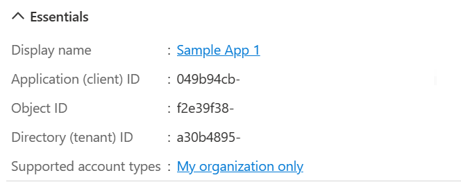
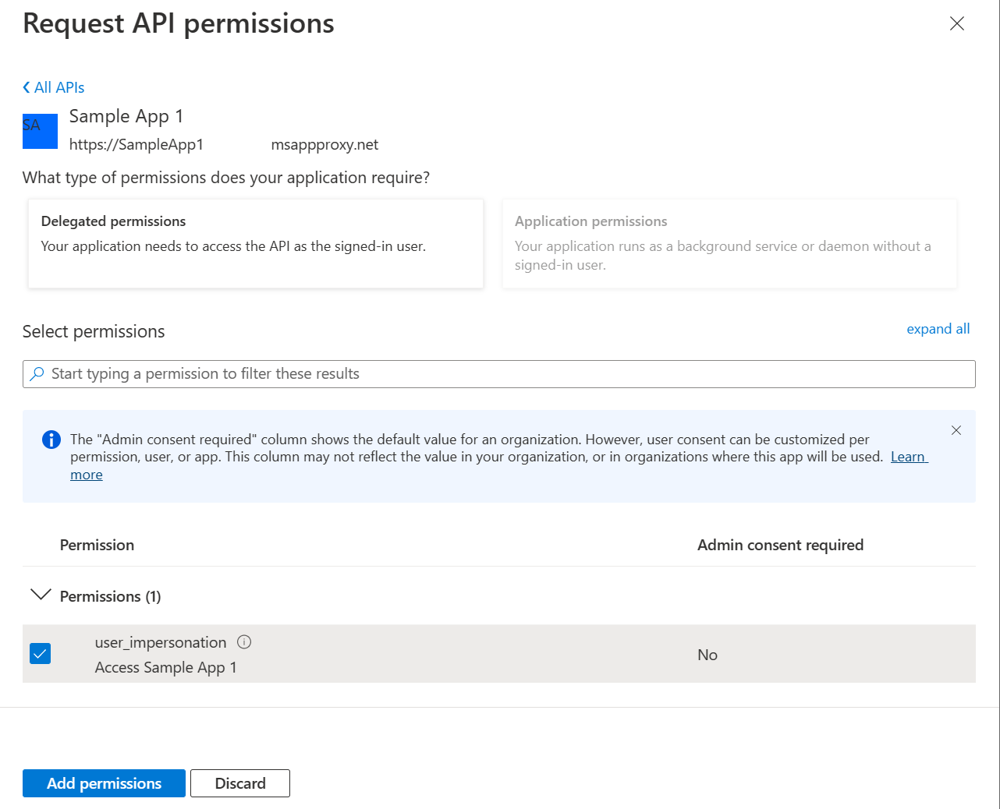
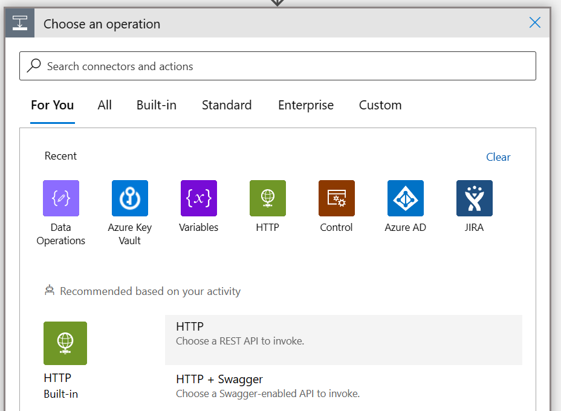
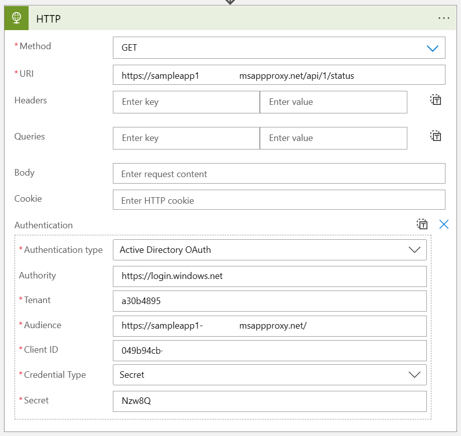

# Securely integrate Azure Logic Apps with on-premises APIs using Azure Active Directory Application Proxy

Azure Logic Apps is a service allowing easy creation of managed workflows in a no-code environment that can integrate with various external services and systems. This can help automate a wide range of business processes, such as data integration, data processing, and event-driven scenarios.
While Logic Apps easily integrate with other public and cloud-based services, the need may arise to utilize Logic Apps with protected, on-premises applications and services without exposing the service to the public via port forwarding or a traditional reverse proxy.

This article describes the steps necessary to utilize the Azure AD Application Proxy solution to provide secure access to a Logic App, while protecting the internal application from unwanted actors. The process and end result is similar to [Access on-premises APIs with Azure Active Directory Application Proxy](./application-proxy-secure-api-access.md) with special attention paid to utilizing the API from within a Logic App.

## Overview

The following diagram shows a traditional way to publish on-premises APIs for access from Azure Logic Apps. This approach requires opening incoming TCP ports 80 and/or 443 to the API service.

The following diagram shows how you can use Azure AD Application Proxy to securely publish APIs for use with Logic Apps (or other Azure Cloud services) without opening any incoming ports:

The Azure AD App Proxy and associated connector facilitate secure authorization and integration to your on-premises services without additional configuration to your network security infrastructure.  

## Prerequisites

To follow this tutorial, you will need:

- Admin access to an Azure directory, with an account that can create and register apps
- The *Logic App Contributor* role (or higher) in an active tenant
- Azure Application Proxy connector deployed and an application configured as detailed in [Add an on-premises app - Application Proxy in Azure Active Directory](./application-proxy-add-on-premises-application.md)

> [!NOTE]
> While granting a user entitlement and testing the sign on is recommended, it is not required for this guide.

## Configure the Application Access

When a new Enterprise Application is created, a matching App Registration is also created. The App Registration allows configuration of secure programmatic access using certificates, secrets, or federated credentials. For integration with a Logic App, we will need to configure a client secret key, and configure the API permissions.

1. From the Azure portal, open **Azure Active Directory**

2. Select the **App Registrations** menu item from the navigation pane

    

3. From the *App Registrations* window, select the **All applications** tab option

4. Navigate to the application with a matching name to your deployed App Proxy application. For example, if you deployed *Sample App 1* as an Enterprise Application, click the **Sample App 1** registration item

    > [!NOTE]
    > If an associated application cannot be found, it may have not been automatically created or may have been deleted. A registration can be created using the **New Registration** button.

5. From the *Sample App 1* detail page, take note of the *Application (client) ID* and *Directory (tenant) ID* fields. These will be used later.

    

6. Select the **API permissions** menu item from the navigation pane

    

7. From the *API permissions* page:

    1. Click the **Add a permission** button

    2. In the *Request API permissions* pop-up:

        1. Select the **APIs my organization uses** tab

        2. Search for your app by name (e.g. *Sample App 1*) and select the item

        3. Ensure *Delegated Permissions* is **selected**, then **check** the box for *user_impersonation*

        4. Click **Add permissions**

    3. Verify the configured permission appears

        

8. Select the **Certificates & secrets** menu item from the navigation pane

    

9. From the *Certificates & secrets* page:

    1. Select the **Client secrets** tab item

    2. Click the **New client secret** button

    3. From the *Add a client secret* pop-up:

        1. Enter a **Description** and desired expiration

        2. Click **Add**

    4. Verify the new client secret appears

    5. Click the **Copy** button for the *Value* of the newly created secret. Save this securely for use later, this value is only shown one time.

        

## Configure the Logic App

1. From the Logic App, open the **Designer** view

2. Select a desired trigger (if prompted)

3. Add a new step and select the **HTTP** operation

    

4. In the operation details:

    1. *Method*: Select the desired HTTP method to be sent to the internal API

    2. *URI*: Fill in with the *public* FQDN of your application registered in Azure AD, along with the additional URI required for API access (e.g. *sampleapp1.msappproxy.net/api/1/status*)

        > [!NOTE]
        > Specific values for API will depend on your internal application. Refer to your application's documentation for more information.

    3. *Headers*: Enter any desired headers to be sent to the internal API

    4. *Queries*: Enter any desired queries to be sent to the internal API

    5. *Body*: Enter any desired body contents to be sent to the internal API

    6. *Cookie*: Enter any desired cookie(s) to be sent to the internal API

    7. Click *Add new parameter*, then check *Authentication*

    8. From the *Authentication type*, select *Active Directory OAuth*

    9. For the authentication, fill the following details:

        1. *Authority*: Enter *https://login.windows.net*

        2. *Tenant*: Enter the **Directory (tenant) ID** noted in *Configure the Application Access*

        3. *Audience*: Enter the *public* FQDN of your application registered in Azure AD (e.g. *sampleapp1.msappproxy.net*)

        4. *Client ID*: Enter the **Application (client) ID** noted in *Configure the Application Access*

        5. *Credential Type*: **Secret**

        6. *Secret*: Enter the **secret value** noted in *Configure the Application Access*

        

5. Save the logic app and test with your trigger

## Caveats

- APIs that require authentication/authorization require special handling when using this method. Since Azure Active Directory OAuth is being used for access, the requests sent already contain an *Authorization* field that cannot also be utilized by the internal API (unless SSO is configured). As a workaround, some applications offer authentication or authorization that uses methods other than an *Authorization* header. For example, GitLab allows for a header titled *PRIVATE-TOKEN*, and Atlassian JIRA allows for requesting a Cookie that can be used in later requests

- While the Logic App HTTP action shows cleartext values, it is highly recommended to store the App Registration Secret Key in Azure Key Vault for secure retrieval and use.

## See Also

- [How to configure an Application Proxy application](./application-proxy-config-how-to.md)
- [Access on-premises APIs with Azure Active Directory Application Proxy](./application-proxy-secure-api-access.md)
- [Common scenarios, examples, tutorials, and walkthroughs for Azure Logic Apps](../../logic-apps/logic-apps-examples-and-scenarios.md)