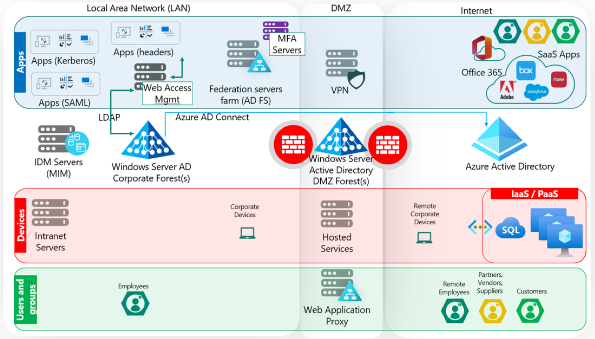
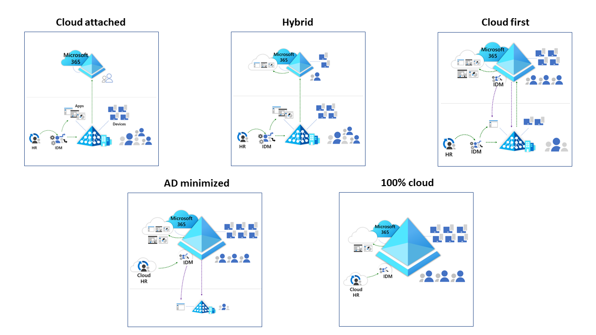

# Cloud transformation posture

Active Directory, Azure Active Directory (Azure AD), and other Microsoft tools are at the core of identity and access management (IAM). For example, Active Directory Domain Services (AD DS) and Microsoft Configuration Manager provide device management in Active Directory. In Azure AD, Intune provides the same capability.

As part of most modernization, migration, or Zero Trust initiatives, organizations shift IAM activities from using on-premises or infrastructure-as-a-service (IaaS) solutions to using built-for-the-cloud solutions. For an IT environment that uses Microsoft products and services, Active Directory and Azure AD play a role.

Many companies that migrate from Active Directory to Azure AD start with an environment that's similar to the following diagram. The diagram overlays three pillars:

* **Applications**: Includes applications, resources, and their underlying domain-joined servers.

* **Devices**: Focuses on domain-joined client devices.

* **Users and Groups**: Represents human and workload identities and attributes for resource access and group membership for governance and policy creation.

Microsoft has modeled five states of transformation that commonly align with the business goals of customers. As the goals of customers mature, it's typical for them to shift from one state to the next at a pace that suits their resources and culture.

The five states have exit criteria to help you determine where your environment resides today. Some projects, such as application migration, span all five states. Other projects span a single state.

The content then provides more detailed guidance that's organized to help with intentional changes to people, process, and technology. The guidance can help you:

* Establish an Azure AD footprint.

* Implement a cloud-first approach.

* Start to migrate out of your Active Directory environment.

Guidance is organized by user management, device management, and application management according to the preceding pillars.

Organizations that are formed in Azure AD rather than in Active Directory don't have the legacy on-premises environment that more established organizations must contend with. For them, or for customers who are completely re-creating their IT environment in the cloud, becoming 100 percent cloud-centric can happen as the new IT environment is established.

For customers who have an established on-premises IT capability, the transformation process introduces complexity that requires careful planning. Also, because Active Directory and Azure AD are separate products targeted at different IT environments, they don't have like-for-like features. For example, Azure AD doesn't have the notion of Active Directory domain and forest trusts.

## Five states of transformation

In enterprise-sized organizations, IAM transformation, or even transformation from Active Directory to Azure AD, is typically a multi-year effort with multiple states. You analyze your environment to determine your current state, and then set a goal for your next state. Your goal might remove the need for Active Directory entirely, or you might decide not to migrate some capability to Azure AD and leave it in place. 

The states logically group initiatives into projects toward completing a transformation. During the state transitions, you put interim solutions in place. The interim solutions enable the IT environment to support IAM operations in both Active Directory and Azure AD. The interim solutions must also enable the two environments to interoperate. 

The following diagram shows the five states:

>[!NOTE]
> The states in this diagram represent a logical progression of cloud transformation. Your ability to move from one state to the next depends on the functionality that you've implemented and the capabilities within that functionality to move to the cloud.

### State 1: Cloud attached

In the cloud-attached state, organizations have created an Azure AD tenant to enable user productivity and collaboration tools. The tenant is fully operational. 

Most companies that use Microsoft products and services in their IT environment are already in or beyond this state. In this state, operational costs might be higher because there's an on-premises environment and a cloud environment to maintain and make interactive. People must have expertise in both environments to support their users and the organization. 

In this state:

* Devices are joined to Active Directory and managed through Group Policy or on-premises device management tools.
* Users are managed in Active Directory, provisioned via on-premises identity management (IDM) systems, and synchronized to Azure AD through Azure AD Connect.
* Apps are authenticated to Active Directory and to federation servers like Active Directory Federation Services (AD FS) through a web access management (WAM) tool, Microsoft 365, or other tools such as SiteMinder and Oracle Access Manager.

### State 2: Hybrid

In the hybrid state, organizations start to enhance their on-premises environment through cloud capabilities. The solutions can be planned to reduce complexity, increase security posture, and reduce the footprint of the on-premises environment. 

During the transition and while operating in this state, organizations grow the skills and expertise for using Azure AD for IAM solutions. Because user accounts and device attachments are relatively easy and a common part of day-to-day IT operations, most organizations have used this approach. 

In this state:

* Windows clients are hybrid Azure AD joined.

* Non-Microsoft platforms based on software as a service (SaaS) start being integrated with Azure AD. Examples are Salesforce and ServiceNow.

* Legacy apps are authenticating to Azure AD via Application Proxy or partner solutions that offer secure hybrid access.

* Self-service password reset (SSPR) and password protection for users are enabled.

* Some legacy apps are authenticated in the cloud through Azure AD DS and Application Proxy.

### State 3: Cloud first

In the cloud-first state, the teams across the organization build a track record of success and start planning to move more challenging workloads to Azure AD. Organizations typically spend the most time in this state of transformation. As complexity, the number of workloads, and the use of Active Directory grow over time, an organization needs to increase its effort and its number of initiatives to shift to the cloud. 

In this state:

* New Windows clients are joined to Azure AD and are managed through Intune.
* ECMA connectors are used to provision users and groups for on-premises apps.
* All apps that previously used an AD DS-integrated federated identity provider, such as AD FS, are updated to use Azure AD for authentication. If you used password-based authentication through that identity provider for Azure AD, it's migrated to password hash synchronization.
* Plans to shift file and print services to Azure AD are being developed.
* Azure AD provides a business-to-business (B2B) collaboration capability.
* New groups are created and managed in Azure AD.

### State 4: Active Directory minimized

Azure AD provides most IAM capability, whereas edge cases and exceptions continue to use on-premises Active Directory. A state of minimizing Active Directory is more difficult to achieve, especially for larger organizations that have significant on-premises technical debt. 

Azure AD continues to evolve as your organization's transformation matures, bringing new features and tools that you can use. Organizations are required to deprecate capabilities or build new capabilities to provide replacement. 

In this state:

* New users provisioned through the HR provisioning capability are created directly in Azure AD.

* A plan to move apps that depend on Active Directory and are part of the vision for the future-state Azure AD environment is being executed. A plan to replace services that won't move (file, print, or fax services) is in place.

* On-premises workloads have been replaced with cloud alternatives such as Windows Virtual Desktop, Azure Files, or Universal Print. Azure SQL Managed Instance replaces SQL Server.

### State 5: 100% cloud

In the 100%-cloud state, Azure AD and other Azure tools provide all IAM capability. This state is the long-term aspiration for many organizations. 

In this state:

* No on-premises IAM footprint is required.

* All devices are managed in Azure AD and cloud solutions such as Intune.

* The user identity lifecycle is managed through Azure AD.

* All users and groups are cloud native.

* Network services that rely on Active Directory are relocated.

## Transformation analogy

The transformation between the states is similar to moving locations:

1. **Establish a new location**: You purchase your destination and establish connectivity between the current location and the new location. These activities enable you to maintain your productivity and ability to operate. For more information, see [Establish an Azure AD footprint](road-to-the-cloud-establish.md). The results transition you to state 2.

1. **Limit new items in the old location**: You stop investing in the old location and set a policy to stage new items in the new location. For more information, see [Implement a cloud-first approach](road-to-the-cloud-implement.md). These activities set the foundation to migrate at scale and reach state 3.

1. **Move existing items to the new location**: You move items from the old location to the new location. You assess the business value of the items to determine if you move them as is, upgrade them, replace them, or deprecate them. For more information, see [Transition to the cloud](road-to-the-cloud-migrate.md). 

   These activities enable you to complete state 3 and reach states 4 and 5. Based on your business objectives, you decide what end state you want to target.

Transformation to the cloud isn't only the identity team's responsibility. The organization needs coordination across teams to define policies that include people and process change, along with technology. Using a coordinated approach helps ensure consistent progress and reduces the risk of regressing to on-premises solutions. Involve teams that manage:

* Devices/endpoints
* Networks
* Security/risk
* Application owners
* Human resources
* Collaboration 
* Procurement
* Operations

### High-level journey

As organizations start a migration of IAM to Azure AD, they must determine the prioritization of efforts based on their specific needs. Operational staff and support staff must be trained to perform their jobs in the new environment. The following chart shows the high-level journey for migration from Active Directory to Azure AD:

:::image type="content" source="media/road-to-cloud-posture/road-to-the-cloud-migration.png" alt-text="Chart that shows three major milestones in migrating from Active Directory to Azure AD: establish Azure AD capabilities, implement a cloud-first approach, and move workloads to the cloud." border="false":::

* **Establish an Azure AD footprint**: Initialize your new Azure AD tenant to support the vision for your end-state deployment. Adopt a [Zero Trust](https://www.microsoft.com/security/blog/2020/04/30/zero-trust-deployment-guide-azure-active-directory/) approach and a security model that [helps protect your tenant from on-premises compromise](../fundamentals/protect-m365-from-on-premises-attacks.md) early in your journey.

* **Implement a cloud-first approach**: Establish a policy that all new devices, apps, and services should be cloud-first. New applications and services that use legacy protocols (for example, NTLM, Kerberos, or LDAP) should be by exception only.

* **Transition to the cloud**: Shift the management and integration of users, apps, and devices away from on-premises and over to cloud-first alternatives. Optimize user provisioning by taking advantage of [cloud-first provisioning capabilities](../governance/what-is-provisioning.md) that integrate with Azure AD. 

The transformation changes how users accomplish tasks and how support teams provide user support. The organization should design and implement initiatives or projects in a way that minimizes the impact on user productivity. 

As part of the transformation, the organization introduces self-service IAM capabilities. Some parts of the workforce more easily adapt to the self-service user environment that's prevalent in cloud-based businesses.

Aging applications might need to be updated or replaced to operate well in cloud-based IT environments. Application updates or replacements can be costly and time-consuming. The planning and other stages must also take the age and capability of the organization's applications into account.

## Next steps

* [Introduction](road-to-the-cloud-introduction.md)
* [Establish an Azure AD footprint](road-to-the-cloud-establish.md)
* [Implement a cloud-first approach](road-to-the-cloud-implement.md)
* [Transition to the cloud](road-to-the-cloud-migrate.md)
