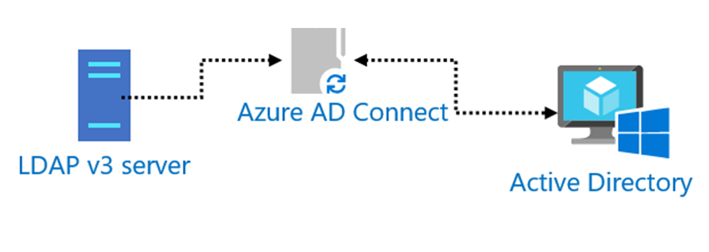

# LDAP synchronization with Azure Active Directory

Lightweight Directory Access Protocol (LDAP) is a directory service protocol that runs on the TCP/IP stack. It provides a mechanism that you can use to connect to, search, and modify internet directories. Based on a client-server model, the LDAP directory service enables access to an existing directory. 

Many companies depend on on-premises LDAP servers to store users and groups for their critical business apps.

Azure Active Directory (Azure AD) can replace LDAP synchronization with Azure AD Connect. The Azure AD Connect synchronization service performs all operations related to synchronizing identity data between you're on premises environments and Azure AD.

## When to use LDAP synchronization

Use LDAP synchronization when you need to synchronize identity data between your on premises LDAP v3 directories and Azure AD as illustrated in the following diagram.

## System components

* **Azure AD**: Azure AD synchronizes identity information (users, groups) from organization's on-premises LDAP directories via Azure AD Connect.
* **Azure AD Connect**: is a tool for connecting on premises identity infrastructures to Microsoft Azure AD. The wizard and guided experiences help to deploy and configure prerequisites and components required for the connection.
* **Custom Connector**: A Generic LDAP Connector enables you to integrate the Azure AD Connect synchronization service with an LDAP v3 server. It sits on Azure AD Connect.
* **Active Directory**: Active Directory is a directory service included in most Windows Server operating systems. Servers that run Active Directory Services, referred to as domain controllers, authenticate and authorize all users and computers in a Windows domain.
* **LDAP v3 server**: LDAP protocol-compliant directory storing corporate users and passwords used for directory services authentication.

## Implement LDAP synchronization with Azure AD

Explore the following resources to learn more about LDAP synchronization with Azure AD.

* [Hybrid Identity: Directory integration tools comparison](../hybrid/plan-hybrid-identity-design-considerations-tools-comparison.md) describes differences between Azure AD Connect sync and Azure AD Connect cloud provisioning.
* [Azure AD Connect and Azure AD Connect Health installation roadmap](../hybrid/how-to-connect-install-roadmap.md) provides detailed installation and configuration steps.
* The [Generic LDAP Connector](/microsoft-identity-manager/reference/microsoft-identity-manager-2016-connector-genericldap) enables you to integrate the synchronization service with an LDAP v3 server.

   > [!NOTE]
   > Deploying the LDAP Connector requires an advanced configuration. Microsoft provides this connector with limited support. Configuring this connector requires familiarity with Microsoft Identity Manager and the specific LDAP directory.
   >
   > When you deploy this configuration in a production environment, collaborate with a partner such as Microsoft Consulting Services for help, guidance, and support.

## Next steps

* [What is hybrid identity with Azure Active Directory?](../../active-directory/hybrid/whatis-hybrid-identity.md) Microsoft's identity solutions span on-premises and cloud-based capabilities. Hybrid identity solutions create a common user identity for authentication and authorization to all resources, regardless of location.
* [Azure Active Directory authentication and synchronization protocol overview](auth-sync-overview.md) describes integration with authentication and synchronization protocols. Authentication integrations enable you to use Azure AD and its security and management features with little or no changes to your applications that use legacy authentication methods. Synchronization integrations enable you to sync user and group data to Azure AD and then user Azure AD management capabilities. Some sync patterns enable automated provisioning.
