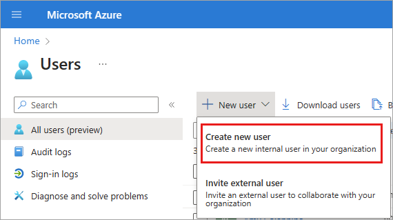
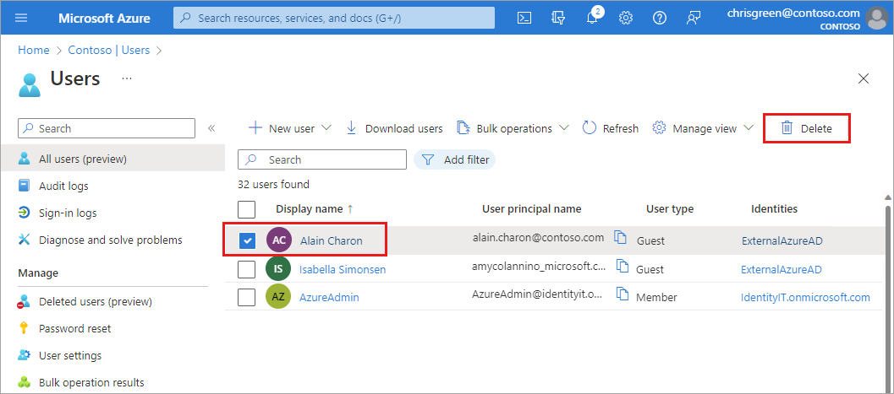

# Add or delete users using Azure Active Directory

Add new users or delete existing users from your Azure Active Directory (Azure AD) tenant. To add or delete users, you must be a User Administrator or Global Administrator. 

[!INCLUDE [GDPR-related guidance](../../../includes/gdpr-hybrid-note.md)]

## Add a new user

[!INCLUDE [portal updates](~/articles/active-directory/includes/portal-update.md)]

You can create a new user for your organization or invite an external user from the same starting point.

1. Sign in to the [Azure portal](https://portal.azure.com) in the User Administrator role.

1. Navigate to **Azure Active Directory** > **Users**.

1. Select either **Create new user** or **Invite external user** from the menu. You can change this setting on the next screen.

    

1. On the **New User** page, provide the new user's information:

   - **Identity:** Add a user name and display name for the user. **User name** and **Name** are required and can't contain accent characters. You can also add a first and last name. 

     The domain part of the user name must use either the initial default domain name, *\<yourdomainname>.onmicrosoft.com*, or a custom domain name, such as *contoso.com*. For more information about how to create a custom domain name, see [Add your custom domain name using the Azure portal](add-custom-domain.md).   

   - **Groups and roles:** Optional. Add the user to one or more existing groups. Group membership can be set at any time. For more information about adding users to groups, see the [manage groups article](how-to-manage-groups.md).

   - **Settings:** Optional. Toggle the option to block sign-in for the user or set the user's default location.

   - **Job info**: Optional. Add the user's job title, department, company name, and manager. These details can be updated at any time. For more information about adding other user info, see [How to manage user profile information](active-directory-users-profile-azure-portal.md).

1. Copy the autogenerated password provided in the **Password** box. You need to give this password to the user to sign in for the first time.

1. Select **Create**.

The user is created and added to your Azure AD organization.

## Add a new guest user

You can also invite new guest user to collaborate with your organization by selecting **Invite user** from the **New user** page. If your organization's external collaboration settings are configured to allow guests, the user will be emailed an invitation they must accept in order to begin collaborating. For more information about inviting B2B collaboration users, see [Invite B2B users to Azure Active Directory](../external-identities/add-users-administrator.md).

The process for inviting a guest is the same as [adding a new user](add-users-azure-active-directory.md#add-a-new-user), with two exceptions. The email address won't follow the same domain rules as users from your organization. You can also include a personal message. 

## Add other users

There might be scenarios in which you want to manually create consumer accounts in your Azure Active Directory B2C (Azure AD B2C) directory. For more information about creating consumer accounts, see [Create and delete consumer users in Azure AD B2C](../../active-directory-b2c/manage-users-portal.md).

If you have an environment with both Azure Active Directory (cloud) and Windows Server Active Directory (on-premises), you can add new users by syncing the existing user account data. For more information about hybrid environments and users, see [Integrate your on-premises directories with Azure Active Directory](../hybrid/whatis-hybrid-identity.md).

## Delete a user

You can delete an existing user using Azure portal.

- You must have a Global Administrator, Privileged Authentication Administrator or User Administrator role assignment to delete users in your organization.
- Global Admins and Privileged Authentication Admins can delete any users including other admins.
- User Administrators can delete any non-admin users, Helpdesk Administrators and other User Administrators.
- For more information, see [Administrator role permissions in Azure AD](../roles/permissions-reference.md).

To delete a user, follow these steps:

1. Sign in to the [Azure portal](https://portal.azure.com) using one of the appropriate roles listed above.

1. Go to **Azure Active Directory** > **Users**.

1. Search for and select the user you want to delete from your Azure AD tenant.

1. Select **Delete user**.

    

The user is deleted and no longer appears on the **Users - All users** page. The user can be seen on the **Deleted users** page for the next 30 days and can be restored during that time. For more information about restoring a user, see [Restore or remove a recently deleted user using Azure Active Directory](active-directory-users-restore.md).

When a user is deleted, any licenses consumed by the user are made available for other users.

>[!Note]
>To update the identity, contact information, or job information for users whose source of authority is Windows Server Active Directory, you must use Windows Server Active Directory. After you complete the update, you must wait for the next synchronization cycle to complete before you'll see the changes.

## Next steps

After you've added your users, you can do the following basic processes:

- [Add or change profile information](active-directory-users-profile-azure-portal.md)

- [Assign roles to users](active-directory-users-assign-role-azure-portal.md)

- [Create a basic group and add members](active-directory-groups-create-azure-portal.md)

- [Work with dynamic groups and users](../enterprise-users/groups-create-rule.md)

- [Add guest users from another directory](../external-identities/what-is-b2b.md)
