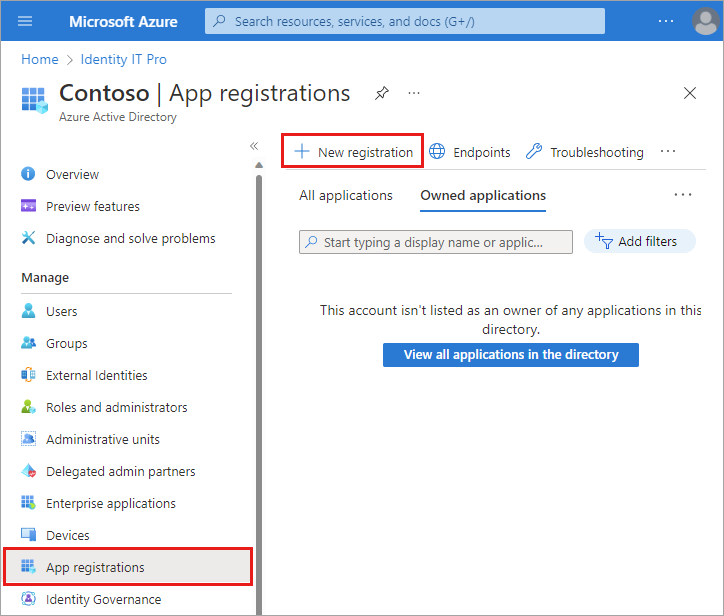
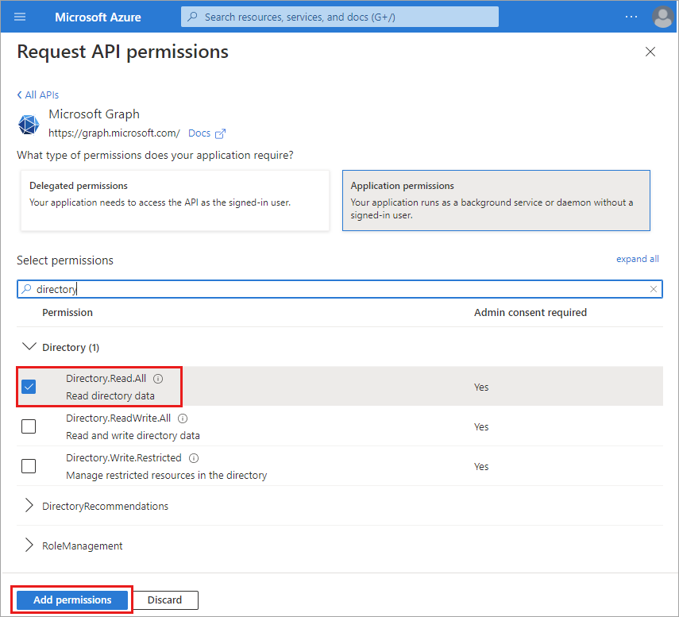
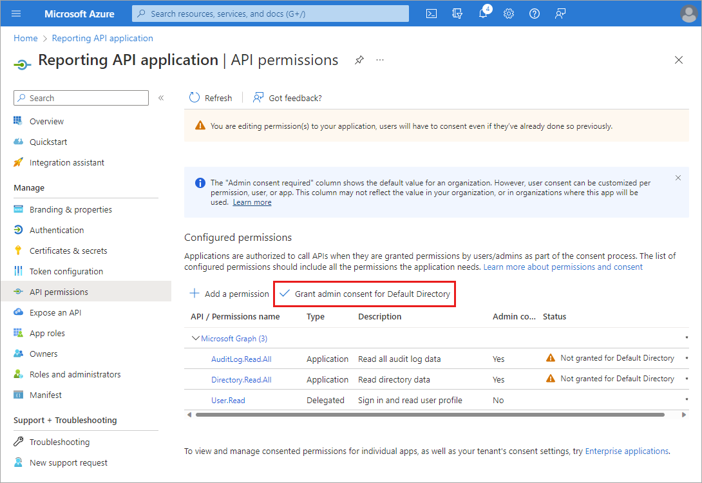

# Prerequisites to access the Azure Active Directory reporting API

The Azure Active Directory (Azure AD) [reporting APIs](/graph/api/resources/azure-ad-auditlog-overview) provide you with programmatic access to the data through a set of REST APIs. You can call these APIs from many programming languages and tools. The reporting API uses [OAuth](../../api-management/api-management-howto-protect-backend-with-aad.md) to authorize access to the web APIs.

This article describes how to enable Microsoft Graph to access the Azure AD reporting APIs in the Azure portal and through PowerShell

## Roles and license requirements

To get access to the reporting data through the API, you need to have one of the following roles:

- Security Reader
- Security Administrator
- Global Administrator

In order to access the sign-in reports for a tenant, an Azure AD tenant must have associated Azure AD Premium P1 or P2 license. Alternatively if the directory type is Azure AD B2C, the sign-in reports are accessible through the API without any additional license requirement. 

Registration is needed even if you're accessing the reporting API using a script. The registration gives you an **Application ID**, which is required for the authorization calls and enables your code to receive tokens. To configure your directory to access the Azure AD reporting API, you must sign in to the [Azure portal](https://portal.azure.com) in one of the required roles.

> [!IMPORTANT]
> Applications running under credentials with administrator privileges can be very powerful, so be sure to keep the application's ID and secret credentials in a secure location.
> 
## Enable the Microsoft Graph API through the Azure portal

To enable your application to access Microsoft Graph without user intervention, you'll need to register your application with Azure AD, then grant permissions to the Microsoft Graph API. This article covers the steps to follow in the Azure portal. 

### Register an Azure AD application

[!INCLUDE [portal updates](~/articles/active-directory/includes/portal-update.md)]

1. Sign in to the [Azure portal](https://portal.azure.com).

1. Go to **Azure Active Directory** > **App registrations**.

1. Select **New registration**.

    

1. On the **Registration an Application** page:
    1. Give the application a **Name** such as `Reporting API application`.
    1. For **Supported accounts type**, select **Accounts in this organizational directory only**.
    1. In the **Redirect URI** section, select **Web** from the list and type `https://localhost`.
    1. Select **Register**.

    

### Grant permissions 

To access the Azure AD reporting API, you must grant your app *Read directory data* and *Read all audit log data* permissions for the Microsoft Graph API.

1. **Azure Active Directory** > **App Registrations**> **API permissions** and select **Add a permission**.

    

1. Select **Microsoft Graph** > **Application permissions**.
1. Add **Directory.Read.All**, **AuditLog.Read.All** and **Policy.Read.ConditionalAccess** then select the **Add permissions** button.
    - If you need more permissions to run the queries you need, you can add them now or modify the permissions as needed in Microsoft Graph.
    - For more information, see [Work with Graph Explorer](/graph/graph-explorer/graph-explorer-features).

    

1. On the **Reporting API Application - API Permissions** page, select **Grant admin consent for Default Directory**.

    

## Access reports using Microsoft Graph Explorer

Once you have the app registration configured, you can run activity log queries in Microsoft Graph.

1. Sign in to https://graph.microsoft.com using the **Security Reader** role. You may need to confirm that you're signed into the appropriate role. Select your profile icon in the upper-right corner of Microsoft Graph.
1. Use one of the following queries to start using Microsoft Graph for accessing activity logs:
    - GET `https://graph.microsoft.com/v1.0/auditLogs/directoryAudits`
    - GET `https://graph.microsoft.com/v1.0/auditLogs/signIns`
    - For more information on Microsoft Graph queries for activity logs, see [Activity reports API overview](/graph/api/resources/azure-ad-auditlog-overview)

    

## Access reports using Microsoft Graph PowerShell

To use PowerShell to access the Azure AD reporting API, you'll need to gather a few configuration settings. These settings were created as a part of the [app registration process](#register-an-azure-ad-application).

- Tenant ID
- Client app ID
- Client secret or certificate

You need these values when configuring calls to the reporting API. We recommend using a certificate because it's more secure.

1. Go to **Azure Active Directory** > **App Registrations**.
1. Copy the **Directory (tenant) ID**.
1. Copy the **Application (client) ID**.
1. Go to **App Registration** > Select your application > **Certificates & secrets** > **Certificates** > **Upload certificate** and upload your certificate's public key file.
    - If you don't have a certificate to upload, follow the steps outlined in the [Create a self-signed certificate to authenticate your application](../develop/howto-create-self-signed-certificate.md) article. 

Next you'll authenticate with the configuration settings you just gathered. Open PowerShell and run the following command, replacing the placeholders with your information.

```powershell
Connect-MgGraph -ClientID YOUR_APP_ID -TenantId YOUR_TENANT_ID -CertificateName YOUR_CERT_SUBJECT ## Or -CertificateThumbprint instead of -CertificateName
```

Microsoft Graph PowerShell cmdlets:

- **Audit logs:** `Get-MgAuditLogDirectoryAudit`
- **Sign-in logs:** `Get-MgAuditLogSignIn`
- **Provisioning logs:** `Get-MgAuditLogProvisioning`
- Explore the full list of [reporting-related Microsoft Graph PowerShell cmdlets](/powershell/module/microsoft.graph.reports).

Programmatic access APIs:
- **Security detections:** [Identity Protection risk detections API](/graph/api/resources/identityprotection-root)
- **Tenant provisioning events:** [Provisioning logs API](/graph/api/resources/provisioningobjectsummary)

### Troubleshoot errors in Azure Active Directory reporting API

**500 HTTP internal server error while accessing Microsoft Graph beta endpoint**: We don't currently support the Microsoft Graph beta endpoint - make sure to access the activity logs using the Microsoft Graph v1.0 endpoint.
- GET `https://graph.microsoft.com/v1.0/auditLogs/directoryAudits`
- GET `https://graph.microsoft.com/v1.0/auditLogs/signIns`

**Error: Neither tenant is B2C or tenant doesn't have premium license**: Accessing sign-in reports requires an Azure Active Directory premium 1 (P1) license. If you see this error message while accessing sign-ins, make sure that your tenant is licensed with an Azure AD P1 license.

**Error: User isn't in the allowed roles**: If you see this error message while trying to access audit logs or sign-ins using the API, make sure that your account is part of the **Security Reader** or **Reports Reader** role in your Azure Active Directory tenant. 

**Error: Application missing Azure AD 'Read directory data' or 'Read all audit log data' permission**: Revisit the **[Grant permissions](#grant-permissions)** section of this article to ensure the permissions are properly set.

## Next steps

* [Get started with Azure Active Directory Identity Protection and Microsoft Graph](../identity-protection/howto-identity-protection-graph-api.md)
* [Audit API reference](/graph/api/resources/directoryaudit) 
* [Sign-in API reference](/graph/api/resources/signin)
