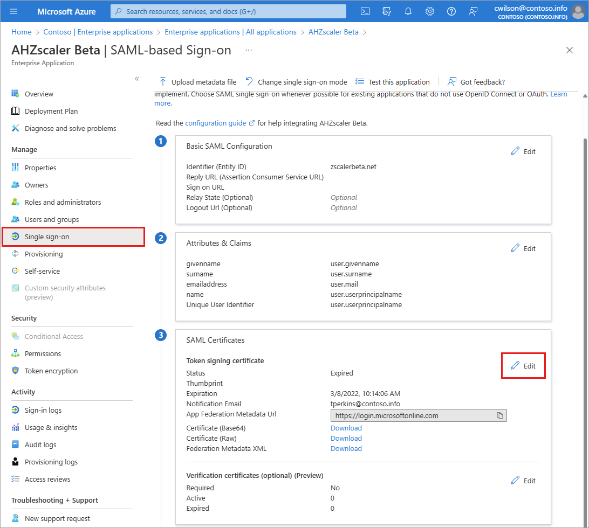

# Azure AD recommendation: Renew expiring service principal credentials (preview)

[Azure AD recommendations](overview-recommendations.md) is a feature that provides you with personalized insights and actionable guidance to align your tenant with recommended best practices.

This article covers the recommendation to renew expiring service principal credentials. This recommendation is called `servicePrincipalKeyExpiry` in the recommendations API in Microsoft Graph. 

## Description

An Azure Active Directory (Azure AD) service principal is the local representation of an application object in a single tenant or directory. The service principal defines who can access an application and what resources the application can access. Authentication of service principals is often completed using certificate credentials, which have a lifespan. If the credentials expire, the application won't be able to authenticate with your tenant. 

This recommendation shows up if your tenant has service principals with credentials that will expire soon.

## Value 

Renewing the service principal credential(s) before expiration ensures the application continues to function and reduces the possibility of downtime due to an expired credential.

## Action plan

1. Select the name of the application from the list of **Impacted resources** to go directly to the **Enterprise applications - Single sign-on** page for the selected application.

    a. Alternatively, go to **Azure AD** > **Enterprise applications**. The status of the service principal appears in the **Certificate Expiry Status** column.
    
    b. Use the search box at the top of the list to find the application that was listed in the recommendation.
      
    c. Select the service principal with the credential that needs to be rotated, then select **Single sign-on** from the side menu.

1. Edit the **SAML signing certificate** section and follow the prompts to add a new certificate.
    
    

1. After adding the certificate, change its properties to make the certificate active, which makes the other certificate inactive.
1. Once the certificate is successfully added and activated, update the service code to ensure it works with the new credential and doesn't negatively affect customers.
1. Use the Azure AD sign-in logs to validate that the Key ID of the certificate matches the one that was recently uploaded.
    - Go to **Azure AD Sign-in logs** > **Service principal sign-ins**.
    - Open the details for a related sign-in and check that the **Client credential type** is "Client secret" and the **Credential key ID** matches your credential.
1. After validating the new credential, navigate back to the **Single sign-on** area for the app and remove the old credential.

### Use Microsoft Graph to renew expiring service principal credentials

You can use Microsoft Graph to renew expiring service credentials programmatically. To get started, see [How to use Microsoft Graph with Azure AD recommendations](howto-use-recommendations.md#how-to-use-microsoft-graph-with-azure-active-directory-recommendations).

When renewing service principal credentials using Microsoft Graph, you need to run a query to get the password credentials on a service principal, add a new password credential, then remove the old credentials. 

1. Run the following query in Microsoft Graph to get the password credentials on a service principal:

    ```http
    https://graph.microsoft.com/v1.0/servicePrincipals/{id}?$select=passwordCredentials
    ```
    - Replace {id} with the service principal ID.

1. Add a new password credential.
    - Use the Microsoft Graph Service Principal API service action `addPassword`
    - [servicePrincipal: addPassword MS Graph API documentation](/graph/api/serviceprincipal-addpassword?view=graph-rest-beta&preserve-view=true)

1. Remove the old/original credentials.
    - Use the Microsoft Graph Service Principal API service action `removePassword`
    - [servicePrincipal: removePassword MS Graph API documentation](/graph/api/serviceprincipal-removepassword?view=graph-rest-beta&preserve-view=true) 

## Known limitations

- This recommendation identifies service principal credentials that are about to expire, so if they do expire, the recommendation doesn't distinguish between the credential expiring on its own or being addressed by the user.

- Service principal credentials that expire before the recommendation is completed will be marked complete by the system.

- The recommendation currently doesn't display the password secret credential in service principal when you select an **Impacted resource** from the list.

- The **ID** shown in the list of **Impacted resources** is for the application not the service principal.

## Next steps

- [Review the Azure AD recommendations overview](overview-recommendations.md)
- [Learn how to use Azure AD recommendations](howto-use-recommendations.md)
- [Explore the Microsoft Graph API properties for recommendations](/graph/api/resources/recommendation)
- [Learn about securing service principals](../fundamentals/service-accounts-principal.md)