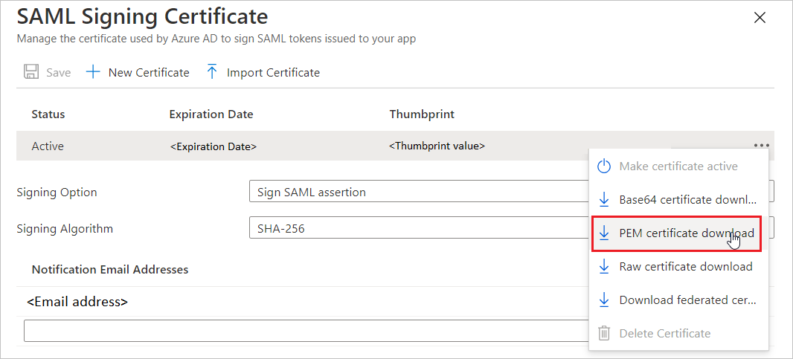

# Azure Active Directory SSO integration with LegalForce

In this article, you learn how to integrate LegalForce with Azure Active Directory (Azure AD). LegalForce automatically checks checklists and contracts for each contract type using technologies such as natural language processing, instantly presents omissions in terms and excesses in clauses, and prevents omissions and omissions. It's equipped with functions that simultaneously improve the quality and efficiency of contract work. When you integrate LegalForce with Azure AD, you can:

* Control in Azure AD who has access to LegalForce.
* Enable your users to be automatically signed-in to LegalForce with their Azure AD accounts.
* Manage your accounts in one central location - the Azure portal.

You'll configure and test Azure AD single sign-on for LegalForce in a test environment. LegalForce supports only **SP** initiated single sign-on.

## Prerequisites

To integrate Azure Active Directory with LegalForce, you need:

* An Azure AD user account. If you don't already have one, you can [Create an account for free](https://azure.microsoft.com/free/?WT.mc_id=A261C142F).
* One of the following roles: Global Administrator, Cloud Application Administrator, Application Administrator, or owner of the service principal.
* An Azure AD subscription. If you don't have a subscription, you can get a [free account](https://azure.microsoft.com/free/).
* LegalForce single sign-on (SSO) enabled subscription.

## Add application and assign a test user

Before you begin the process of configuring single sign-on, you need to add the LegalForce application from the Azure AD gallery. You need a test user account to assign to the application and test the single sign-on configuration.

### Add LegalForce from the Azure AD gallery

Add LegalForce from the Azure AD application gallery to configure single sign-on with LegalForce. For more information on how to add application from the gallery, see the [Quickstart: Add application from the gallery](../manage-apps/add-application-portal.md).

### Create and assign Azure AD test user

Follow the guidelines in the [create and assign a user account](../manage-apps/add-application-portal-assign-users.md) article to create a test user account in the Azure portal called B.Simon.

Alternatively, you can also use the [Enterprise App Configuration Wizard](https://portal.office.com/AdminPortal/home?Q=Docs#/azureadappintegration). In this wizard, you can add an application to your tenant, add users/groups to the app, and assign roles. The wizard also provides a link to the single sign-on configuration pane in the Azure portal. [Learn more about Microsoft 365 wizards.](/microsoft-365/admin/misc/azure-ad-setup-guides). 

## Configure Azure AD SSO

Complete the following steps to enable Azure AD single sign-on in the Azure portal.

1. In the Azure portal, on the **LegalForce** application integration page, find the **Manage** section and select **single sign-on**.
1. On the **Select a single sign-on method** page, select **SAML**.
1. On the **Set up single sign-on with SAML** page, select the pencil icon for **Basic SAML Configuration** to edit the settings.

   

1. On the **Basic SAML Configuration** section, perform the following steps:

	a. In the **Identifier** textbox, type a URL using the following pattern:
	`urn:auth0:legalforce:saml-<ORG.CUSTOMERID>` 

	b. In the **Reply URL** textbox, type a URL using the following pattern:
	`https://auth.legalforce-cloud.com/login/callback?connection=saml-$<ORG.CUSTOMERID>`

	c. In the **Sign on URL** textbox, type the URL:
	`https://app.legalforce-cloud.com/`

	> [!Note]
    > These values are not real. Update these values with the actual Identifier and Reply URL. Contact [LegalForce support team](mailto:support@legalforce.co.jp) to get these values. You can also refer to the patterns shown in the **Basic SAML Configuration section** in the Azure portal.

 1. On the **Set up single sign-on with SAML** page, in the **SAML Signing Certificate** section, find **Certificate (PEM)** and select **Download** to download the certificate and save it on your computer.

	

1. On the **Set up LegalForce** section, copy the appropriate URL(s) based on your requirement.

	

## Configure LegalForce SSO

To configure single sign-on on **LegalForce** side, you need to send the downloaded **Certificate (PEM)** and appropriate copied URLs from Azure portal to [LegalForce support team](mailto:support@legalforce.co.jp). They set this setting to have the SAML SSO connection set properly on both sides

### Create LegalForce test user

In this section, you create a user called Britta Simon at LegalForce. Work with [LegalForce support team](mailto:support@legalforce.co.jp) to add the users in the LegalForce platform. Users must be created and activated before you use single sign-on.

## Test SSO 

In this section, you test your Azure AD single sign-on configuration with following options. 

* Click on **Test this application** in Azure portal. This will redirect to LegalForce Sign-on URL where you can initiate the login flow. 

* Go to LegalForce Sign-on URL directly and initiate the login flow from there.

* You can use Microsoft My Apps. When you click the LegalForce tile in the My Apps, this will redirect to LegalForce Sign-on URL. For more information about the My Apps, see [Introduction to the My Apps](../user-help/my-apps-portal-end-user-access.md).

## Next steps

Once you configure LegalForce you can enforce session control, which protects exfiltration and infiltration of your organization’s sensitive data in real time. Session control extends from Conditional Access. [Learn how to enforce session control with Microsoft Cloud App Security](/cloud-app-security/proxy-deployment-aad).
