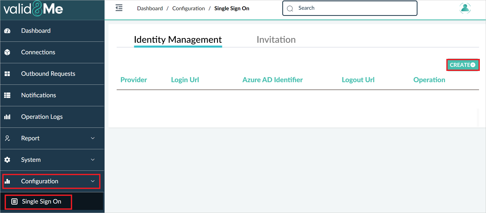
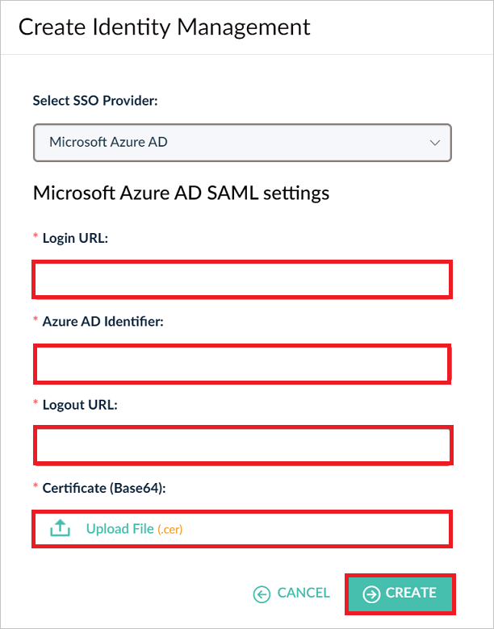
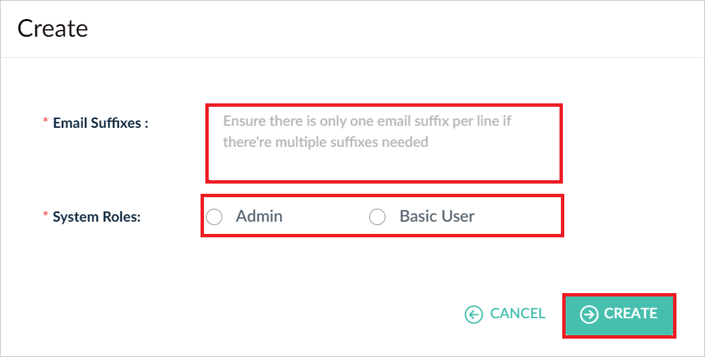

# Tutorial: Azure AD SSO integration with valid8Me

In this tutorial, you'll learn how to integrate valid8Me with Azure Active Directory (Azure AD). When you integrate valid8Me with Azure AD, you can:

* Control in Azure AD who has access to valid8Me.
* Enable your users to be automatically signed-in to valid8Me with their Azure AD accounts.
* Manage your accounts in one central location - the Azure portal.

## Prerequisites

To get started, you need the following items:

* An Azure AD subscription. If you don't have a subscription, you can get a [free account](https://azure.microsoft.com/free/).
* valid8Me single sign-on (SSO) enabled subscription.
* Along with Cloud Application Administrator, Application Administrator can also add or manage applications in Azure AD.
For more information, see [Azure built-in roles](../roles/permissions-reference.md).

## Scenario description

In this tutorial, you configure and test Azure AD SSO in a test environment.

* valid8Me supports **SP** and **IDP** initiated SSO.

> [!NOTE]
> Identifier of this application is a fixed string value so only one instance can be configured in one tenant.

## Add valid8Me from the gallery

To configure the integration of valid8Me into Azure AD, you need to add valid8Me from the gallery to your list of managed SaaS apps.

1. Sign in to the Azure portal using either a work or school account, or a personal Microsoft account.
1. On the left navigation pane, select the **Azure Active Directory** service.
1. Navigate to **Enterprise Applications** and then select **All Applications**.
1. To add new application, select **New application**.
1. In the **Add from the gallery** section, type **valid8Me** in the search box.
1. Select **valid8Me** from results panel and then add the app. Wait a few seconds while the app is added to your tenant.

 Alternatively, you can also use the [Enterprise App Configuration Wizard](https://portal.office.com/AdminPortal/home?Q=Docs#/azureadappintegration). In this wizard, you can add an application to your tenant, add users/groups to the app, assign roles, as well as walk through the SSO configuration as well. [Learn more about Microsoft 365 wizards.](/microsoft-365/admin/misc/azure-ad-setup-guides)

## Configure and test Azure AD SSO for valid8Me

Configure and test Azure AD SSO with valid8Me using a test user called **B.Simon**. For SSO to work, you need to establish a link relationship between an Azure AD user and the related user at valid8Me.

To configure and test Azure AD SSO with valid8Me, perform the following steps:

1. **[Configure Azure AD SSO](#configure-azure-ad-sso)** - to enable your users to use this feature.
    1. **[Create an Azure AD test user](#create-an-azure-ad-test-user)** - to test Azure AD single sign-on with B.Simon.
    1. **[Assign the Azure AD test user](#assign-the-azure-ad-test-user)** - to enable B.Simon to use Azure AD single sign-on.
1. **[Configure valid8Me SSO](#configure-valid8me-sso)** - to configure the single sign-on settings on application side.
    1. **[Create valid8Me test user](#create-valid8me-test-user)** - to have a counterpart of B.Simon in valid8Me that is linked to the Azure AD representation of user.
1. **[Test SSO](#test-sso)** - to verify whether the configuration works.

## Configure Azure AD SSO

Follow these steps to enable Azure AD SSO in the Azure portal.

1. In the Azure portal, on the **valid8Me** application integration page, find the **Manage** section and select **single sign-on**.
1. On the **Select a single sign-on method** page, select **SAML**.
1. On the **Set up single sign-on with SAML** page, click the pencil icon for **Basic SAML Configuration** to edit the settings.

    

1. On the **Basic SAML Configuration** section, the user does not have to perform any step as the app is already pre-integrated with Azure.

1. If you wish to configure the application in **SP** initiated mode:

    In the **Sign on URL (Optional)** text box, type a URL using the following pattern:
    `https://login.valid8me.com/?idp=https://sts.windows.net/${TenantID}/`

    > [!Note]
    > This value is not real. Update this value with the actual Sign on URL. Contact [valid8Me support team](mailto:support@valid8me.com) to get the value. You can also refer to the patterns shown in the **Basic SAML Configuration** section in the Azure portal.

1. On the **Set up single sign-on with SAML** page, in the **SAML Signing Certificate** section,  find **Certificate (Base64)** and select **Download** to download the certificate and save it on your computer.

    

1. On the **Set up valid8Me** section, copy the appropriate URL(s) based on your requirement.

	  

### Create an Azure AD test user

In this section, you'll create a test user in the Azure portal called B.Simon.

1. From the left pane in the Azure portal, select **Azure Active Directory**, select **Users**, and then select **All users**.
1. Select **New user** at the top of the screen.
1. In the **User** properties, follow these steps:
   1. In the **Name** field, enter `B.Simon`.  
   1. In the **User name** field, enter the username@companydomain.extension. For example, `B.Simon@contoso.com`.
   1. Select the **Show password** check box, and then write down the value that's displayed in the **Password** box.
   1. Click **Create**.

### Assign the Azure AD test user

In this section, you'll enable B.Simon to use Azure single sign-on by granting access to valid8Me.

1. In the Azure portal, select **Enterprise Applications**, and then select **All applications**.
1. In the applications list, select **valid8Me**.
1. In the app's overview page, find the **Manage** section and select **Users and groups**.
1. Select **Add user**, then select **Users and groups** in the **Add Assignment** dialog.
1. In the **Users and groups** dialog, select **B.Simon** from the Users list, then click the **Select** button at the bottom of the screen.
1. If you are expecting a role to be assigned to the users, you can select it from the **Select a role** dropdown. If no role has been set up for this app, you see "Default Access" role selected.
1. In the **Add Assignment** dialog, click the **Assign** button.

## Configure valid8Me SSO

1. Log in to your valid8Me company site as an administrator.

1. From the left side menu, expand **Configuration** >  **Single Sign On** > **Identity Management** tab and click Create.
    
    

1. In the **Microsoft Azure AD SAML settings** section, perform the following steps:

    

    a. In the **Login URL** textbox, paste the **Login URL** value, which you have copied from the Azure portal.

    b. In the **Azure AD Identifier** textbox, paste the **Azure AD Identifier** value, which you have copied from the Azure portal.

    c. In the **Logout URL** textbox, paste the **Logout URL** value, which you have copied from the Azure portal.

    d. Open the downloaded **Certificate (Base64)** from the Azure portal into Notepad and upload file into the **Certificate (Base64)** textbox.

    e. Click **Create**.

### Create valid8Me test user

1. In a different web browser window, log in to your valid8Me website as an administrator.

1. Navigate to **Configuration** >  **Single Sign On** > **Invitation** tab and click **Create**. 
    
1. Perform the following steps in the **Create** page:

    

    1. Enter a valid email domain in the **Email Suffixes** textbox.
    
        > [!Note]
        > the domain name should be same as Microsoft Azure Active Directory account email domain.

    1. Select one of the **System Roles** according to your requirement.

    1. Click **Create**.

## Test SSO 

In this section, you test your Azure AD single sign-on configuration with following options. 

#### SP initiated:

* Click on **Test this application** in Azure portal. This will redirect to valid8Me Sign on URL where you can initiate the login flow.  

* Go to valid8Me Sign on URL directly and initiate the login flow from there.

#### IDP initiated:

* Click on **Test this application** in Azure portal and you should be automatically signed in to the valid8Me for which you set up the SSO. 

You can also use Microsoft My Apps to test the application in any mode. When you click the valid8Me tile in the My Apps, if configured in SP mode you would be redirected to the application sign-on page for initiating the login flow and if configured in IDP mode, you should be automatically signed in to the valid8Me for which you set up the SSO. For more information about the My Apps, see [Introduction to the My Apps](../user-help/my-apps-portal-end-user-access.md).

## Next steps

Once you configure valid8Me you can enforce session control, which protects exfiltration and infiltration of your organization’s sensitive data in real time. Session control extends from Conditional Access. [Learn how to enforce session control with Microsoft Cloud App Security](/cloud-app-security/proxy-deployment-aad).