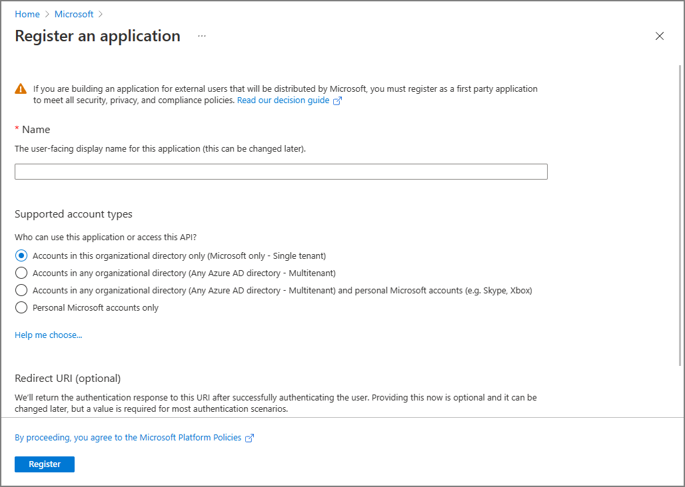
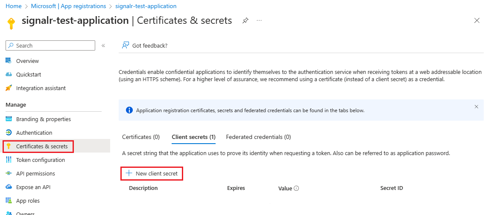

# Authorize request to SignalR resources with Azure AD from Azure applications

Azure SignalR Service supports Azure Active Directory (Azure AD) authorizing requests from [Azure applications](../active-directory/develop/app-objects-and-service-principals.md).

This article shows how to configure your SignalR resource and codes to authorize the request to a SignalR resource from an Azure application.

## Register an application

The first step is to register an Azure application.

1. On the [Azure portal](https://portal.azure.com/), search for and select **Azure Active Directory**
2. Under **Manage** section, select **App registrations**.
3. Select **New registration**.

    

4. Enter a display **Name** for your application.
5. Select **Register** to confirm the register.

Once you have your application registered, you can find the **Application (client) ID** and **Directory (tenant) ID** under its Overview page. These GUIDs can be useful in the following steps.


To learn more about registering an application, see
- [Quickstart: Register an application with the Microsoft identity platform](../active-directory/develop/quickstart-register-app.md).


## Add credentials

You can add both certificates and client secrets (a string) as credentials to your confidential client app registration.

### Client secret

The application requires a client secret to prove its identity when requesting a token. To create a client secret, follow these steps.

1. Under **Manage** section, select **Certificates & secrets**
1. On the **Client secrets** tab, select **New client secret**.

1. Enter a **description** for the client secret, and choose a **expire time**.
1. Copy the value of the **client secret** and then paste it to a secure location. 
    > [!NOTE]
    > The secret will display only once.

### Certificate

You can also upload a certification instead of creating a client secret.


To learn more about adding credentials, see

- [Add credentials](../active-directory/develop/quickstart-register-app.md#add-credentials)

## Add role assignments on Azure portal

The following steps describe how to assign a `SignalR App Server` role to a service principal (application) over a SignalR resource. For detailed steps, see [Assign Azure roles using the Azure portal](../role-based-access-control/role-assignments-portal.md).

> [!Note]
> A role can be assigned to any scope, including management group, subscription, resource group or a single resource. To learn more about scope, see [Understand scope for Azure RBAC](../role-based-access-control/scope-overview.md)

1. From the [Azure portal](https://portal.azure.com/), navigate to your SignalR resource.

1. Select **Access control (IAM)**.

1. Select **Add > Add role assignment**.

   :::image type="content" source="../../includes/role-based-access-control/media/add-role-assignment-menu-generic.png" alt-text="Screenshot that shows Access control (IAM) page with Add role assignment menu open.":::

1. On the **Role** tab, select **SignalR App Server**.

1. On the **Members** tab, select **User, group, or service principal**, and then select **Select members**.

1. Search for and select the application that to which you'd like to assign the role.

1. On the **Review + assign** tab, select **Review + assign** to assign the role.

> [!IMPORTANT]
> Azure role assignments may take up to 30 minutes to propagate.

To learn more about how to assign and manage Azure role assignments, see these articles:
- [Assign Azure roles using the Azure portal](../role-based-access-control/role-assignments-portal.md)
- [Assign Azure roles using the REST API](../role-based-access-control/role-assignments-rest.md)
- [Assign Azure roles using Azure PowerShell](../role-based-access-control/role-assignments-powershell.md)
- [Assign Azure roles using Azure CLI](../role-based-access-control/role-assignments-cli.md)
- [Assign Azure roles using Azure Resource Manager templates](../role-based-access-control/role-assignments-template.md)

## Configure your app

### App server

The best practice is to configure identity and credentials in your environment variables:

| Variable	| Description |
|------|------
| `AZURE_TENANT_ID`	| The Azure Active Directory tenant(directory) ID. |
| `AZURE_CLIENT_ID`	| The client(application) ID of an App Registration in the tenant. |
| `AZURE_CLIENT_SECRET`	| A client secret that was generated for the App Registration. |
| `AZURE_CLIENT_CERTIFICATE_PATH` | A path to a certificate and private key pair in PEM or PFX format, which can authenticate the App Registration. |
| `AZURE_USERNAME`	| The username, also known as upn, of an Azure Active Directory user account. |
| `AZURE_PASSWORD`	| The password for the Azure Active Directory user account. Password isn't supported for accounts with MFA enabled. |

You can use either [DefaultAzureCredential](/dotnet/api/azure.identity.defaultazurecredential) or [EnvironmentCredential](/dotnet/api/azure.identity.environmentcredential) to configure your SignalR endpoints.

```C#
services.AddSignalR().AddAzureSignalR(option =>
{
    option.Endpoints = new ServiceEndpoint[]
    {
        new ServiceEndpoint(new Uri("https://<resource-name>.service.signalr.net"), new DefaultAzureCredential())
    };
});
```

Or using `EnvironmentalCredential` directly.

```C#
services.AddSignalR().AddAzureSignalR(option =>
{
    option.Endpoints = new ServiceEndpoint[]
    {
        new ServiceEndpoint(new Uri("https://<resource-name>.service.signalr.net"), new EnvironmentCredential())
    };
});
```

To learn how `DefaultAzureCredential` works, see [DefaultAzureCredential Class](/dotnet/api/overview/azure/identity-readme#defaultazurecredential).

#### Use different credentials while using multiple endpoints.

For some reason, you may want to use different credentials for different endpoints.

In this scenario, you can use [ClientSecretCredential](/dotnet/api/azure.identity.clientsecretcredential) or [ClientCertificateCredential](/dotnet/api/azure.identity.clientcertificatecredential).

```csharp
services.AddSignalR().AddAzureSignalR(option =>
{
    var credential1 = new ClientSecretCredential("tenantId", "clientId", "clientSecret");
    var credential2 = new ClientCertificateCredential("tenantId", "clientId", "pathToCert");

    option.Endpoints = new ServiceEndpoint[]
    {
        new ServiceEndpoint(new Uri("https://<resource1>.service.signalr.net"), credential1),
        new ServiceEndpoint(new Uri("https://<resource2>.service.signalr.net"), credential2),
    };
});
```

### Azure Functions SignalR bindings

Azure Functions SignalR bindings use [application settings](../azure-functions/functions-how-to-use-azure-function-app-settings.md) on portal or [`local.settings.json`](../azure-functions/functions-develop-local.md#local-settings-file) at local to configure Azure application identities to access your SignalR resources.

Firstly, you need to specify the service URI of the SignalR Service,  whose key is `serviceUri` starting with a **connection name prefix** (defaults to `AzureSignalRConnectionString`) and a separator (`__` on Azure portal and `:` in the local.settings.json file). The connection name can be customized with the binding property [`ConnectionStringSetting`](../azure-functions/functions-bindings-signalr-service.md). Continue reading to find the sample.

Then you choose to configure your Azure application identity in [pre-defined environment variables](#configure-identity-in-pre-defined-environment-variables) or [in SignalR specified variables](#configure-identity-in-signalr-specified-variables).

#### Configure identity in pre-defined environment variables

See [Environment variables](/dotnet/api/overview/azure/identity-readme#environment-variables) for the list of pre-defined environment variables. When you have multiple services, we recommend that you use the same application identity, so that you don't need to configure the identity for each service. These environment variables might also be used by other services according to the settings of other services.

For example, to use client secret credentials,  configure as follows in the `local.settings.json` file.
```json
{
  "Values": {
    "<CONNECTION_NAME_PREFIX>:serviceUri": "https://<SIGNALR_RESOURCE_NAME>.service.signalr.net",
    "AZURE_CLIENT_ID":"...",
    "AZURE_CLIENT_SECRET":"...",
    "AZURE_TENANT_ID":"..."
  }
}
```
On Azure portal, add settings as follows:
```
 <CONNECTION_NAME_PREFIX>__serviceUri=https://<SIGNALR_RESOURCE_NAME>.service.signalr.net
AZURE_CLIENT_ID = ...
AZURE_TENANT_ID = ...
AZURE_CLIENT_SECRET = ...
 ```

#### Configure identity in SignalR specified variables

The SignalR specified variables share the same key prefix with `serviceUri` key. Here's the list of variables you might use:
* clientId
* clientSecret
* tenantId

Here are the samples to use client secret credentials:

In the `local.settings.json` file:
```json
{
  "Values": {
    "<CONNECTION_NAME_PREFIX>:serviceUri": "https://<SIGNALR_RESOURCE_NAME>.service.signalr.net",
    "<CONNECTION_NAME_PREFIX>:clientId": "...",
    "<CONNECTION_NAME_PREFIX>:clientSecret": "...",
    "<CONNECTION_NAME_PREFIX>:tenantId": "..."
  }
}
```

On Azure portal, add settings as follows:
```
<CONNECTION_NAME_PREFIX>__serviceUri = https://<SIGNALR_RESOURCE_NAME>.service.signalr.net
<CONNECTION_NAME_PREFIX>__clientId = ...
<CONNECTION_NAME_PREFIX>__clientSecret = ...
<CONNECTION_NAME_PREFIX>__tenantId = ...
```
## Next steps

See the following related articles:
- [Overview of Azure AD for SignalR](signalr-concept-authorize-azure-active-directory.md)
- [Authorize request to SignalR resources with Azure AD from managed identities](signalr-howto-authorize-managed-identity.md)
- [Disable local authentication](./howto-disable-local-auth.md)