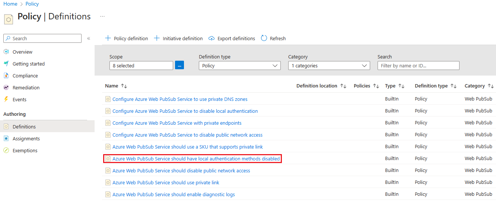

# Disable local (access key) authentication with Azure Web PubSub Service

There are two ways to authenticate to Azure Web PubSub Service resources: Azure Active Directory (Azure AD) and Access Key. Azure AD provides superior security and ease of use over access key. With Azure AD, there’s no need to store the tokens in your code and risk potential security vulnerabilities. We recommend that you use Azure AD with your Azure Web PubSub Service resources when possible.

> [!IMPORTANT]
> Disabling local authentication can have following influences.
> - The current set of access keys will be permanently deleted. 
> - Tokens signed with current set of access keys will become unavailable. 
> - Signature will **NOT** be attached in the upstream request header. Please visit *[how to validate access token](./howto-use-managed-identity.md#validate-access-tokens)* to learn how to validate requests via Azure AD token.

## Use Azure portal

In this section, you will learn how to use the Azure portal to disable local authentication.

1. Navigate to your Web PubSub Service resource in the [Azure portal](https://portal.azure.com).

2. in the **Settings** section of the menu sidebar, select **Keys** tab.

3. Select **Disabled** for local authentication.

4. Click **Save** button.


## Use Azure Resource Manager template

You can disable local authentication by setting `disableLocalAuth` property to true as shown in the following Azure Resource Manager template.

```json
{
    "$schema": "https://schema.management.azure.com/schemas/2019-04-01/deploymentTemplate.json#",
    "contentVersion": "1.0.0.0",
    "parameters": {
        "resource_name": {
            "defaultValue": "test-for-disable-aad",
            "type": "String"
        }
    },
    "variables": {},
    "resources": [
        {
            "type": "Microsoft.SignalRService/WebPubSub",
            "apiVersion": "2022-08-01-preview",
            "name": "[parameters('resource_name')]",
            "location": "eastus",
            "sku": {
                "name": "Premium_P1",
                "tier": "Premium",
                "size": "P1",
                "capacity": 1
            },
            "properties": {
                "tls": {
                    "clientCertEnabled": false
                },
                "networkACLs": {
                    "defaultAction": "Deny",
                    "publicNetwork": {
                        "allow": [
                            "ServerConnection",
                            "ClientConnection",
                            "RESTAPI",
                            "Trace"
                        ]
                    },
                    "privateEndpoints": []
                },
                "publicNetworkAccess": "Enabled",
                "disableLocalAuth": true,
                "disableAadAuth": false
            }
        }
    ]
}
```

## Use Azure Policy

You can assign the [Azure Web PubSub Service should have local authentication methods disabled](https://ms.portal.azure.com/#view/Microsoft_Azure_Policy/PolicyDetailBlade/definitionId/%2Fproviders%2FMicrosoft.Authorization%2FpolicyDefinitions%2Fb66ab71c-582d-4330-adfd-ac162e78691e) Azure policy to an Azure subscription or a resource group to enforce disabling of local authentication for all Web PubSub resources in the subscription or the resource group.



## Next steps

See the following docs to learn about authentication methods.

- [Overview of Azure AD for Web PubSub](concept-azure-ad-authorization.md)
- [Authenticate with Azure applications](./howto-authorize-from-application.md)
- [Authenticate with managed identities](./howto-authorize-from-managed-identity.md)
