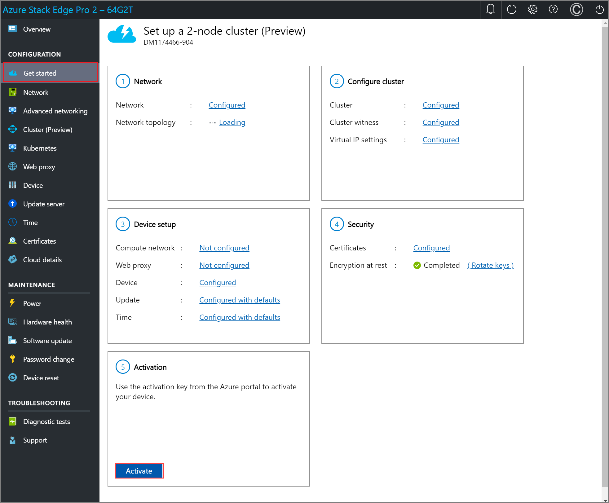
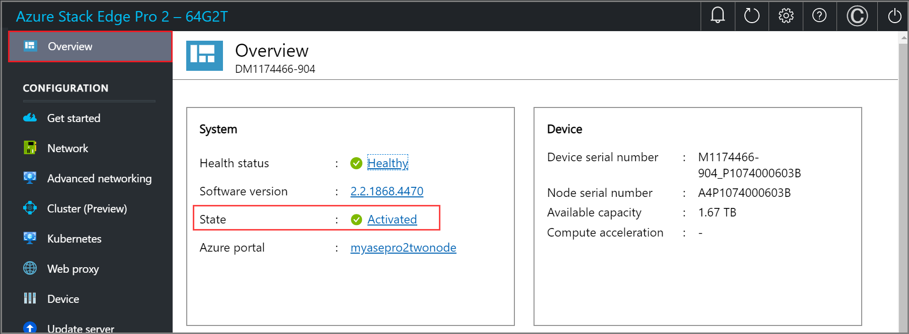

# Tutorial: Activate Azure Stack Edge Pro 2

This tutorial describes how you can activate your Azure Stack Edge Pro 2 device by using the local web UI.

The activation process can take around 5 minutes to complete.

In this tutorial, you learned about:

> [!div class="checklist"]
> * Prerequisites
> * Activate the physical device

## Prerequisites

Before you configure and set up your Azure Stack Edge Pro 2, make sure that:

* For your physical device: 
    
    - You've installed the physical device as detailed in [Install Azure Stack Edge Pro 2](azure-stack-edge-pro-2-deploy-install.md).
    - You've configured the network and compute network settings as detailed in [Configure network, compute network, web proxy](azure-stack-edge-pro-2-deploy-configure-network-compute-web-proxy.md)
    - You've uploaded your own or generated the device certificates on your device if you changed the device name or the DNS domain via the **Device** page. If you haven't done this step, you'll see an error during the device activation and the activation will be blocked. For more information, go to [Configure certificates](azure-stack-edge-pro-2-deploy-configure-certificates.md).
    
* You have the activation key from the Azure Stack Edge service that you created to manage the Azure Stack Edge Pro 2 device. For more information, go to [Prepare to deploy Azure Stack Edge Pro 2](azure-stack-edge-pro-2-deploy-prep.md).


## Activate the device

1. In the local web UI of the device, go to **Get started** page.
2. On the **Activation** tile, select **Activate**. 

    
    
3. In the **Activate** pane, enter the **Activation key** from [Get the activation key for Azure Stack Edge](azure-stack-edge-gpu-deploy-prep.md#get-the-activation-key).

4. Select **Activate**.

    


5. First the device is activated. You're then prompted to download the key file.
    
    
    
    Select **Download and continue** and save the *device-serial-no.json* file in a safe location outside of the device. **This key file contains the recovery keys for the OS disk and data disks on your device**. These keys may be needed to facilitate a future system recovery.

    Here are the contents of the *json* file:

    ```json
    {
      "Id": "<Device ID>",
      "DataVolumeBitLockerExternalKeys": {
        "hcsinternal": "<BitLocker key for data disk>",
        "hcsdata": "<BitLocker key for data disk>"
      },
      "SystemVolumeBitLockerRecoveryKey": "<BitLocker key for system volume>",
      "SEDEncryptionExternalKey": "<Encryption-at-rest key for encrypted disks>",
      "ServiceEncryptionKey": "<Azure service encryption key>"
    }
    ```        
 
    The following table explains the various keys:
    
    |Field  |Description  |
    |---------|---------|
    |`Id`    | This is the ID for the device.        |
    |`DataVolumeBitLockerExternalKeys`| These are the BitLocker keys for the data disks and are used to recover the local data on your device.|
    |`SystemVolumeBitLockerRecoveryKey`| This is the BitLocker key for the system volume. This key helps with the recovery of the system configuration and system data for your device. |
    |`SEDEncryptionExternalKey`| This user provided or system generated key is used to protect the self-encrypting data drives that have a built-in encryption. |
    |`ServiceEncryptionKey`| This key protects the data flowing through the Azure service. This key ensures that a compromise of the Azure service won't result in a compromise of stored information. |

6. Go to the **Overview** page. The device state should show as **Activated**.

   
 
The device activation is complete. You can now add shares on your device.

If you encounter any issues during activation, go to [Troubleshoot activation and Azure Key Vault errors](azure-stack-edge-gpu-troubleshoot-activation.md#activation-errors).


## Deploy workloads

After you've activated the device, the next step is to deploy workloads.

- To deploy VM workloads, see [What are VMs on Azure Stack Edge?](azure-stack-edge-gpu-virtual-machine-overview.md) and the associated VM deployment documentation.
- To deploy network functions as managed applications:
    - Make sure that you create a Device resource for Azure Network Function Manager (NFM) that is linked to the Azure Stack Edge resource. The device resource aggregates all the network functions deployed on Azure Stack Edge device. For detailed instructions, see [Tutorial: Create a Network Function Manager Device resource (Preview)](../network-function-manager/create-device.md). 
    - You can then deploy Network Function Manager as per the instructions in [Tutorial: Deploy network functions on Azure Stack Edge (Preview)](../network-function-manager/deploy-functions.md).
- To deploy IoT Edge and Kubernetes workloads:
    - You'll need to first configure compute as described in [Tutorial: Configure compute on Azure Stack Edge Pro 2 device](azure-stack-edge-pro-2-deploy-configure-compute.md). This step creates a Kubernetes cluster that acts as the hosting platform for IoT Edge on your device. 
    - After a Kubernetes cluster is created on your Azure Stack Edge device, you can deploy application workloads on this cluster via any of the following methods:

        - Native access via `kubectl`
        - IoT Edge
        - Azure Arc
        
        For more information on workload deployment, see [Kubernetes workload management on your Azure Stack Edge device](azure-stack-edge-gpu-kubernetes-workload-management.md).

## Next steps

In this tutorial, you learned about:

> [!div class="checklist"]
> * Prerequisites
> * Activate the physical device

To learn how to deploy workloads on your Azure Stack Edge device, see:

> [!div class="nextstepaction"]
> [Configure compute to deploy IoT Edge and Kubernetes workloads on Azure Stack Edge Pro 2](./azure-stack-edge-pro-2-deploy-configure-compute.md)