# Exchange AS2 messages using workflows in Azure Logic Apps

[!INCLUDE [logic-apps-sku-consumption-standard](../../includes/logic-apps-sku-consumption-standard.md)]

To send and receive AS2 messages in workflows that you create using Azure Logic Apps, you can use the **AS2 (v2)** connector, which provides actions that support and manage AS2 communication. If you need tracking capabilities, the original **AS2** connector is still available, but is being deprecated.

Except for tracking capabilities, the **AS2 (v2)** connector provides the same capabilities as the original **AS2** connector, runs natively with the Azure Logic Apps runtime, and offers significant performance improvements in message size, throughput, and latency. Unlike the original **AS2** connector, the **AS2 (v2)** connector doesn't require that you create a connection to your integration account. Instead, as described in the prerequisites, make sure that you link your integration account to the logic app resource where you plan to use the connector.

This article shows how to add the AS2 encoding and decoding actions to an existing logic app workflow. The **AS2 (v2)** connector doesn't include any triggers, so you can use any trigger to start your workflow. The examples in this article use the [Request](../connectors/connectors-native-reqres.md) trigger.

## Connector technical reference

The AS2 connector has different versions, based on [logic app type and host environment](logic-apps-overview.md#resource-environment-differences).

| Logic app | Environment | Connector version |
|-----------|-------------|-------------------|
| **Consumption** | Multi-tenant Azure Logic Apps | **AS2 (v2)** and **AS2** managed connectors (Standard class). The **AS2 (v2)** connector provides only actions, but you can use any trigger that works for your scenario. For more information, review the following documentation:   - [AS2 managed connector reference](/connectors/as2/)  - [AS2 (v2) managed connector operations](#as2-v2-operations)  - [B2B protocol limits for message sizes](logic-apps-limits-and-config.md#b2b-protocol-limits)  - [Managed connectors in Azure Logic Apps](../connectors/managed.md) |
| **Consumption** | Integration service environment (ISE) | **AS2 (v2)** and **AS2** managed connectors (Standard class) and **AS2** ISE version, which has different message limits than the Standard class.  The **AS2 (v2)** connector provides only actions, but you can use any trigger that works for your scenario. For more information, review the following documentation:   - [AS2 managed connector reference](/connectors/as2/)  - [AS2 (v2) managed connector operations](#as2-v2-operations)  - [ISE message limits](logic-apps-limits-and-config.md#message-size-limits)  - [Managed connectors in Azure Logic Apps](../connectors/managed.md) |
| **Standard** | Single-tenant Azure Logic Apps and App Service Environment v3 (Windows plans only) | **AS2 (v2)** built-in connector and **AS2** managed connector. The built-in version differs in the following ways:   - The built-in version provides only actions, but you can use any trigger that works for your scenario.   - The built-in version can directly access Azure virtual networks. You don't need an on-premises data gateway.  For more information, review the following documentation:   - [AS2 managed connector reference](/connectors/as2/)  - [AS2 (v2) built-in connector operations](#as2-v2-operations)  - [Built-in connectors in Azure Logic Apps](../connectors/built-in.md) |

### AS2 (v2) operations

The **AS2 (v2)** connector has no triggers. The following table describes the actions that the **AS2 (v2)** connector provides for establishing security and reliability when transmitting messages:

| Action | Description |
|--------|-------------|
| [**AS2 Encode** action](#encode) | Provides encryption, digital signing, and acknowledgments through Message Disposition Notifications (MDN), which help support non-repudiation. For example, this action applies AS2/HTTP headers and performs the following tasks when configured:   - Sign outgoing messages.  - Encrypt outgoing messages.  - Compress the message.  - Transmit the file name in the MIME header. |
| [**AS2 Decode** action](#decode) | Provide decryption, digital signing, and acknowledgments through Message Disposition Notifications (MDN). For example, this action performs the following tasks when configured:   - Process AS2/HTTP headers.  - Reconcile received MDNs with the original outbound messages.  - Update and correlate records in the non-repudiation database.  - Write records for AS2 status reporting.  - Output payload contents as base64-encoded.   -  Determine whether MDNs are required. Based on the AS2 agreement, determine whether MDNs should be synchronous or asynchronous.  - Generate synchronous or asynchronous MDNs based on the AS2 agreement.  - Set the correlation tokens and properties on MDNs.  - Verify the signature.  - Decrypt the messages.  - Decompress the message.  - Check and disallow message ID duplicates. |

## Prerequisites

* An Azure account and subscription. If you don't have a subscription yet, [sign up for a free Azure account](https://azure.microsoft.com/free/?WT.mc_id=A261C142F).

* The logic app resource and workflow where you want to use the AS2 operations.

* An [integration account resource](logic-apps-enterprise-integration-create-integration-account.md) to define and store artifacts for use in enterprise integration and B2B workflows.

  > [!IMPORTANT]
  >
  > To work together, both your integration account and logic app resource must exist in the same Azure subscription and Azure region.

* At least two [trading partners](logic-apps-enterprise-integration-partners.md) in your integration account. The definitions for both partners must use the same *business identity* qualifier, which is **AS2Identity** for this scenario.

* An [AS2 agreement](logic-apps-enterprise-integration-agreements.md) in your integration account between the trading partners that participate in your workflow. Each agreement requires a host partner and a guest partner. The content in the messages between you and the other partner must match the agreement type.

* Based on whether you're working on a Consumption or Standard logic app workflow, your logic app resource might require a link to your integration account:

  | Logic app workflow | Link required? |
  |--------------------|----------------|
  | Consumption | - **AS2 (v2)** connector: Connection required, but no link required  - **AS2** connector: [Link required](logic-apps-enterprise-integration-create-integration-account.md?tabs=consumption#link-account), but no connection required |
  | Standard | - **AS2 (v2)** connector: [Link required](logic-apps-enterprise-integration-create-integration-account.md?tabs=standard#link-account), but no connection required  - **AS2** connector: Connection required, but no link required |

* If you use [Azure Key Vault](../key-vault/general/overview.md) for certificate management, check that your vault keys permit the **Encrypt** and **Decrypt** operations. Otherwise, the encoding and decoding actions fail.

  1. In the [Azure portal](https://portal.azure.com), open your key vault. On the key vault menu, under **Settings**, select **Keys**.

  1. On the **Keys** pane, select your key. On the **Versions** pane, select the key version that you're using.

  1. On the **Key Version** pane, under **Permitted operations**, confirm that the **Encrypt** and **Decrypt** operations are selected, for example:

     

## Encode AS2 messages

Select the tab for either Consumption or Standard logic app workflows:

### [Consumption](#tab/consumption)

#### AS2 v2 connector

1. In the [Azure portal](https://portal.azure.com), open your logic app resource and workflow in the designer.

1. On the designer, under the trigger or action where you want to add the **AS2 (v2)** action, select **New step**.

1. Under the **Choose an operation** search box, select **Standard**. In the search box, enter **as2**.

1. From the actions list, select the action named **AS2 Encode**.

   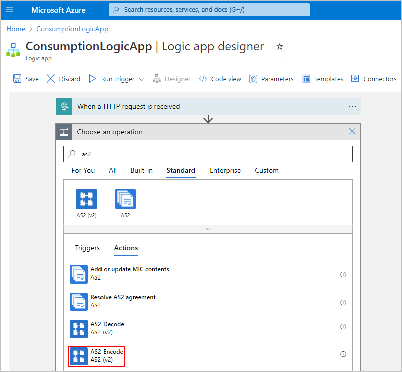

1. In the action information box, provide the following information.

   | Property | Required | Description |
   |----------|----------|-------------|
   | **Message to encode** | Yes | The message payload, for example, the **Body** output from the Request trigger.   1. Put your cursor in the **Message to encode** box so that the dynamic content list opens.  2. Next to the section name **When a HTTP request is received**, select **See more**.  3. From the outputs list, select **Body**. |
   | **AS2 from** | Yes | The business identifier for the message sender as specified by your AS2 agreement, for example, **Fabrikam**. |
   | **AS2 to** | Yes | The business identifier for the message receiver as specified by your AS2 agreement, for example, **Contoso**. |

   

#### AS2 connector

1. In the [Azure portal](https://portal.azure.com), open your logic app resource and workflow in the designer.

1. On the designer, under the trigger or action where you want to add the **AS2** action, select **New step**.

1. Under the **Choose an operation** search box, select **Standard**. In the search box, enter **as2 encode**.

1. From the actions list, select the action named **Encode to AS2 message**.

   

1. When prompted to create a connection to your integration account, provide the following information:

   | Property | Required | Description |
   |----------|----------|-------------|
   | **Connection name** | Yes | A name for the connection |
   | **Integration Account** | Yes | From the list of available integration accounts, select the account to use. |

   For example:

   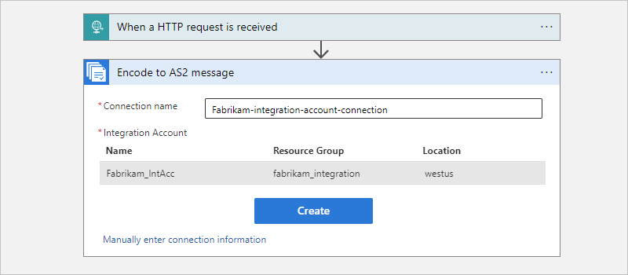

1. When you're done, select **Create**.

1. In the action information box, provide the following information.

   | Property | Required | Description |
   |----------|----------|-------------|
   | **AS2-From** | Yes | The business identifier for the message sender as specified by your AS2 agreement, for example, **Fabrikam**. |
   | **AS2-To** | Yes | The business identifier for the message receiver as specified by your AS2 agreement, for example, **Contoso**. |
   | **body** | Yes | The message payload to encode, for example, the **Body** output from the Request trigger.   1. Put your cursor in the **body** box so that the dynamic content list opens.  2. Next to the section name **When a HTTP request is received**, select **See more**.  3. From the outputs list, select **Body**. |

   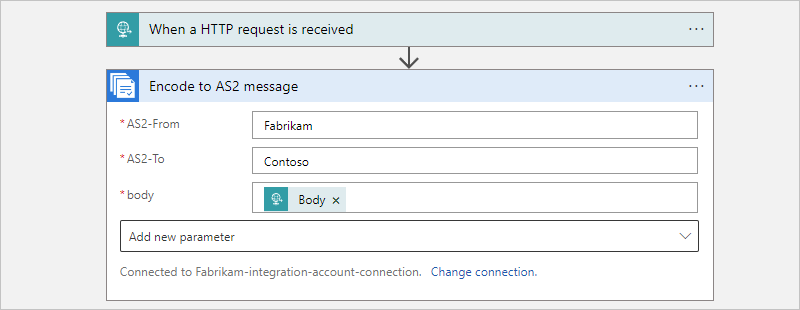

### [Standard](#tab/standard)

#### AS2 v2 connector

1. In the [Azure portal](https://portal.azure.com), open your logic app resource and workflow in the designer.

1. On the designer, under the trigger or action where you want to add the **AS2 (v2)** action, select **Insert a new step** (plus sign), and then select **Add an action**.

1. Under the **Choose an operation** search box, select **Built-in**. In the search box, enter **as2 encode**.

1. From the actions list, select the action named **AS2 Encode**.

   

1. In the action information pane, provide the following information:

   | Property | Required | Description |
   |----------|----------|-------------|
   | **Message to encode** | Yes | The message payload to encode, for example, the **Body** output from the Request trigger.   1. Put your cursor in the **Message to encode** box so that the dynamic content list opens.  2. Next to the section name **When a HTTP request is received**, select **See more**.  3. From the outputs list, select **Body**. |
   | **AS2 from** | Yes | The business identifier for the message sender as specified by your AS2 agreement, for example, **Fabrikam**. |
   | **AS2 to** | Yes | The business identifier for the message receiver as specified by your AS2 agreement, for example, **Contoso**. |

   For example, the message payload is the **Body** content output from the Request trigger:

   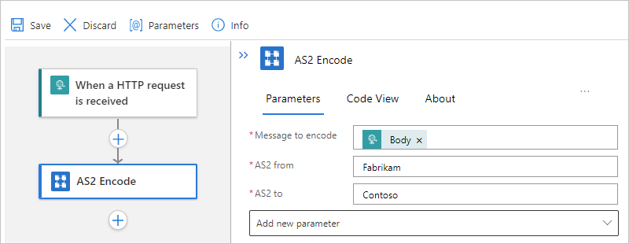

#### AS2 connector

1. In the [Azure portal](https://portal.azure.com), open your logic app resource and workflow in the designer.

1. On the designer, under the trigger or action where you want to add the **AS2** action, select **Insert a new step** (plus sign), and then select **Add an action**.

1. Under the **Choose an operation** search box, select **Azure**. In the search box, enter **as2 encode**.

1. From the actions list, select the action named **Encode to AS2 message**.

   

1. When prompted to create a connection to your integration account, provide the following information:

   | Property | Required | Description |
   |----------|----------|-------------|
   | **Connection name** | Yes | A name for the connection |
   | **Integration Account** | Yes | From the list of available integration accounts, select the account to use. |

   For example:

   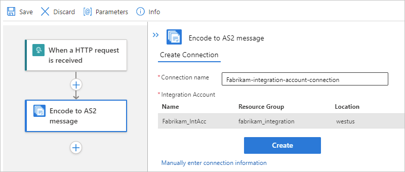

1. When you're done, select **Create**.

1. In the action information pane, provide the following information.

   | Property | Required | Description |
   |----------|----------|-------------|
   | **AS2-From** | Yes | The business identifier for the message sender as specified by your AS2 agreement, for example, **Fabrikam**. |
   | **AS2-To** | Yes | The business identifier for the message receiver as specified by your AS2 agreement, for example, **Contoso**. |
   | **body** | Yes | The message payload to encode, for example, the **Body** output from the Request trigger.   1. Put your cursor in the **body** box so that the dynamic content list opens.  2. Next to the section name **When a HTTP request is received**, select **See more**.  3. From the outputs list, select **Body**. |

   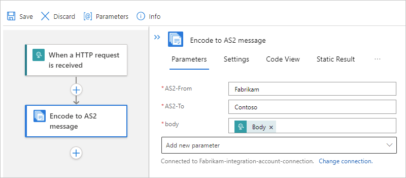

---

## Decode AS2 messages

Select the tab for either Consumption or Standard logic app workflows:

### [Consumption](#tab/consumption)

#### AS2 v2 connector

1. In the [Azure portal](https://portal.azure.com), open your logic app resource and workflow in the designer.

1. On the designer, under the trigger or action where you want to add the **AS2 (v2)** action, select **New step**.

1. Under the **Choose an operation** search box, select **Standard**. In the search box, enter **as2**.

1. From the actions list, select the action named **AS2 Decode**.

   

1. In the action information box, provide the following information:

   | Property | Required | Description |
   |----------|----------|-------------|
   | **body** | Yes | The body for the message to decode, for example, the **Body** output from the Request trigger.   1. Put your cursor in the **body** box so that the dynamic content list opens.  2. Next to the section name **When a HTTP request is received**, select **See more**.  3. From the outputs list, select **Body**. |
   | **Headers** | Yes | The headers for the message to decode, for example, the **Headers** output from the Request trigger.   1. Put your cursor in the **Headers** box so that the dynamic content list opens.  2. Next to the section name **When a HTTP request is received**, select **See more**.  3. From the outputs list, select **Headers**. |

   For example:

   

#### AS2 connector

1. In the [Azure portal](https://portal.azure.com), open your logic app resource and workflow in the designer.

1. On the designer, under the trigger or action where you want to add the **AS2** action, select **New step**.

1. Under the **Choose an operation** search box, select **Standard**. In the search box, enter **as2 decode**.

1. From the actions list, select the action named **Decode AS2 message**.

   

1. When prompted to create a connection to your integration account, provide the following information:

   | Property | Required | Description |
   |----------|----------|-------------|
   | **Connection name** | Yes | A name for the connection |
   | **Integration Account** | Yes | From the list of available integration accounts, select the account to use. |

   For example:

   

1. When you're done, select **Create**.

1. In the action information box, provide the following information.

   | Property | Required | Description |
   |----------|----------|-------------|
   | **body** | Yes | The message payload, for example, the **Body** output from the Request trigger.   1. Put your cursor in the **body** box so that the dynamic content list opens.  2. Next to the section name **When a HTTP request is received**, select **See more**.  3. From the outputs list, select **Body**. |
   | **Headers** | Yes | The headers for the message to decode, for example, the **Headers** output from the Request trigger.   1. Put your cursor in the **Headers** box so that the dynamic content list opens.  2. Next to the section name **When a HTTP request is received**, select **See more**.  3. From the outputs list, select **Headers**. |

   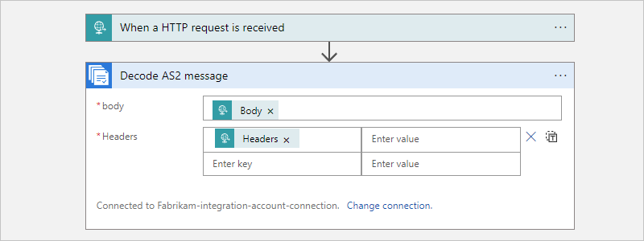

### [Standard](#tab/standard)

#### AS2 v2 connector

1. In the [Azure portal](https://portal.azure.com), open your logic app resource and workflow in the designer.

1. On the designer, under the trigger or action where you want to add the AS2 action, select **Insert a new step** (plus sign), and then select **Add an action**.

1. Under the **Choose an operation** search box, select **Built-in**. In the search box, enter **as2 decode**.

1. From the actions list, select the action named **AS2 Decode**.

   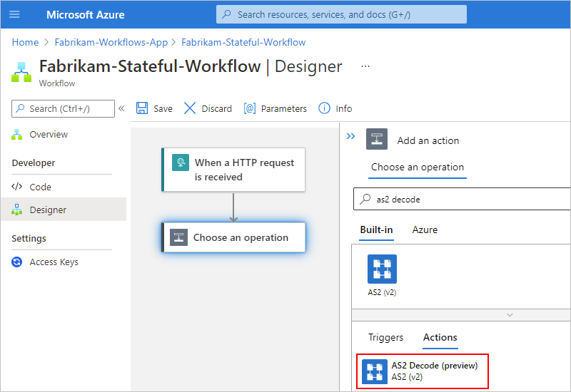

1. In the action information pane, provide the following information:

   | Property | Required | Description |
   |----------|----------|-------------|
   | **Message to decode** | Yes | The message payload to decode, for example, the **Body** output from the Request trigger.   1. Put your cursor in the **Message to decode** box so that the dynamic content list opens.  2. Next to the section name **When a HTTP request is received**, select **See more**.  3. From the outputs list, select **Body**. |
   | **Message headers** | Yes | The headers for the message to decode, for example, the **Headers** output from the Request trigger.   1. Put your cursor in the **Message headers** box so that the dynamic content list opens.  2. Next to the section name **When a HTTP request is received**, select **See more**.  3. From the outputs list, select **Headers**. |

   For example:

   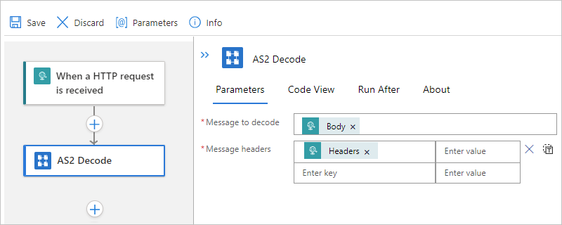

#### AS2 connector

1. In the [Azure portal](https://portal.azure.com), open your logic app resource and workflow in the designer.

1. On the designer, under the trigger or action where you want to add the AS2 action, select **Insert a new step** (plus sign), and then select **Add an action**.

1. Under the **Choose an operation** search box, select **Azure**. In the search box, enter **as2 decode**.

1. From the actions list, select the action named **Decode AS2 message**.

   

1. When prompted to create a connection to your integration account, provide the following information:

   | Property | Required | Description |
   |----------|----------|-------------|
   | **Connection name** | Yes | A name for the connection |
   | **Integration Account** | Yes | From the list of available integration accounts, select the account to use. |

   For example:

   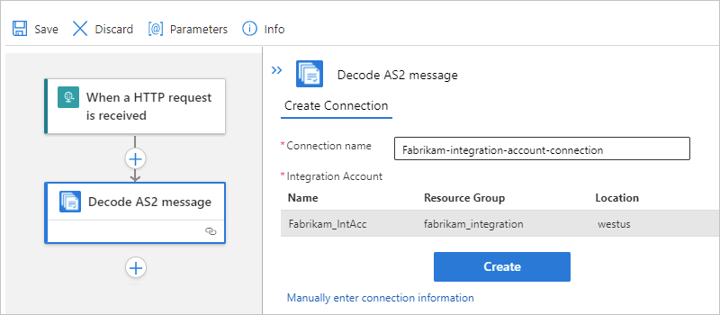

1. When you're done, select **Create**.

1. In the action information pane, provide the following information:

   | Property | Required | Description |
   |----------|----------|-------------|
   | **body** | Yes | The message payload, for example, the **Body** output from the Request trigger.   1. Put your cursor in the **body** box so that the dynamic content list opens.  2. Next to the section name **When a HTTP request is received**, select **See more**.  3. From the outputs list, select **Body**. |
   | **Headers** | Yes | The headers for the message to decode, for example, the **Headers** output from the Request trigger.   1. Put your cursor in the **Headers** box so that the dynamic content list opens.  2. Next to the section name **When a HTTP request is received**, select **See more**.  3. From the outputs list, select **Headers**. |

   For example:

   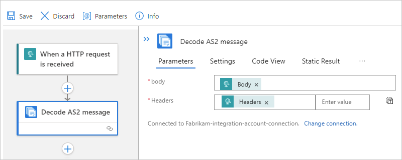

---

## Sample

To try deploying a fully operational logic app and sample AS2 (v2) scenario, review the [AS2 (v2) logic app template and scenario](https://azure.microsoft.com/resources/templates/logic-app-as2-send-receive/).

## Troubleshoot problems

* Problems when sending signed or encrypted messages

  Consider trying different SHA256 algorithm formats. The AS2 specification doesn't provide any information about SHA256 formats, so each provider uses their own implementation or format.

## Next steps

* [Managed connectors for Azure Logic Apps](/connectors/connector-reference/connector-reference-logicapps-connectors)